# Overview
In this post we'll look into how you can easily create an interesting website using public data, that you can then monitise and use to impress future employers!
You'll learn why you should be building a personal project using public data, and you'll be walked through an example of building an app that utilises public data from scratch all the way to deployment with its own domain.

# Why should I create my own personal project?
Developers often create personal projects for a variety of reasons, some of these are:
- To show off to future employers that they know what they are doing
- To learn a new technology
- For fun
- For profit
These don't have to be mutually exclusive, often you can build a project that hits all of these!

As well, if you're looking to break into the software industry then building up your portfolio by creating personal projects is one of the best ways to land a job.

# Why should I use public data?
If you're looking for ideas for projects then public data can be a great place to look for inspiration.  
Public data is easy to get hold of, is free(!), and can be combined with other data to provide massive value to users.  

Often public data isn't presented in a user-friendly format, so even just presenting data in a way that users can understand can be a big win and not very complicated.

Some examples of sources of public data:
- government (which we'll see an example of later)
  - health data, e.g. number of vaccinations in England can be found [here](https://coronavirus.data.gov.uk/details/vaccinations?areaType=nation&areaName=England).
  - tax data, e.g. Council tax statistics can be found [here](https://www.gov.uk/government/statistical-data-sets/live-tables-on-council-tax).
- Video games
  - Popular online video games have their own APIs such as the World of Warcraft API, which can be found [here](https://develop.battle.net/documentation/world-of-warcraft/game-data-apis).
  - Some games have community-run APIs such as the PokéAPI for Pokémon, which can be found [here](https://pokeapi.co/).

These are just a few examples. You could also scrape data from websites if they don't offer a nice way to get their data, depending on their data usage policies, however that deserves its own separate post. 
If you're interested in web scraping, you can find a tutorial [here](https://www.freecodecamp.org/news/web-scraping-python-tutorial-how-to-scrape-data-from-a-website/) from FreeCodeCamp.

The best data to pick is what is most interesting to you, or that solves a particular problem that you're facing. That way you're much more likely to stick with the project!

# Creating a Website that shows the driving tests centres with the best pass rates near you
Here we'll walk through a step-by-step guide on how we can build a website that allows users to search for driving test centres near them and show which has the best pass rates.  
We'll be using the UK Government's public data on driving test centre pass rates.  
I built this because I'm looking to learn to drive and I wanted to see which test centre I'd have the best chance with!

Let's set out the requirements:
- The user can see the best driving test centres around them, based on their postcode.
- The user can see the best driving test centres around popular cities.
- The user can see the Google Reviews rating for each test centre.
- The user can easily see where the test centre is located on Google Maps.

And with that, let's get started!

## Setting up the app
For this application we'll be using Next.JS as the framework and Material UI for the design.  
If you haven't used Next.JS before don't worry. If you've ever used React before then the majority of it will be clear.

The reason that I used Next.JS was for its static site generation, which makes it lightning fast. 
Most of the data that I use here is not dynamic, which means that we can generate our pages at build time.
Not only does this make the application load extremely fast, it's also good for SEO (Search Engine Optimisation) 
which is very important if we want to monitise our application later.  
Next.JS has a good intro on SEO which can be found [here](https://nextjs.org/learn/seo/introduction-to-seo).  
It's also very easy to host, which we'll see later.

Throughout this post we'll see how we can use Next.JS for static site generation, however you can read more about Next.JS [here](https://nextjs.org/docs/getting-started).

- NextJs Typescript starter
- Material UI

To start, lets initialise our project:
```bash
> npx create-next-app@latest --ts
```
Once this has completed we can start up our application by running:
```bash
npm run dev
```

Opening localhost:3000 should then show us the Next.js example page:  
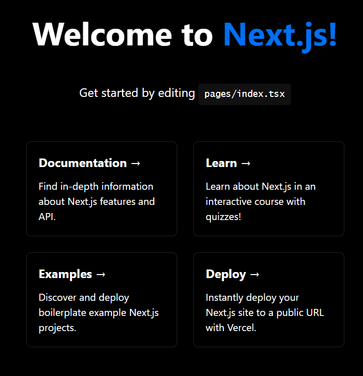

Your directory structure should look like this:


## Getting the Data

### Getting the test centre data
Please note that in this section I'll be deliberately brief on the details. 
This is partly because the point of this post isn't to copy what I did entirely, but rather to provide inspiration, 
but also because I don't want this post to be any longer than it needs to be. I leave the massaging of data as an exercise for the reader.

Before we get into building our web app, we'll need to get the driving test centre data.  
We can download this from the gov.uk's page on driving test pass rates [here](https://www.gov.uk/government/statistical-data-sets/car-driving-test-data-by-test-centre),
and selecting the "Car pass rates by gender, month and test centre" document.

This document contains a tab for each year, with a record of the total pass rate for all men and women that year for each driving test centre.
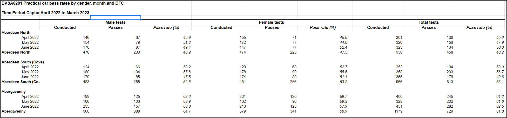

As an example, we can see that Aberdeen North had a total pass rate of 48.2% for the year 2022-23.  
You can use your favourite scripting language to pull this data out, you'll need to get a list of each test centre name with its total pass rate.  

### Getting the location data for each test centre
In order to calculate the distance from the user to each test centre we'll need to find the location of each test centre. 
One way to do this is to use the Google Maps Places API. 
Whilst the API is not free it does include 28,500 free map-loads per month, which will be much more than what we need.

Before we can use the Places API, we'll need to get our own API key. The instructions for this can be found [here](https://developers.google.com/maps/documentation/javascript/get-api-key).

The API that we'll need is the Places API, specifically the `findplacefromtext` and `details` endpoints. 

We'll use these endpoints to get the following fields:
- geometry: The longitude and latitude of the test centre location 
- rating: The Google reviews rating for the location
- user_ratings_total: The total number of reviews left for the location
- url: The link to the location in Google Maps.

We can use the `findplacefromtext` endpoint to first search for our test centres by name, and get back the possible candidates with their name and place ID.  
For example, when searching for Mill Hill (London) driving test centre, we can query the following:
https://maps.googleapis.com/maps/api/place/findplacefromtext/json?input=Mill%20Hill%20(London)%20Driving%20Test%20Centre&inputtype=textquery&key=<YOUR API KEY>&locationbias=ipbias&fields=name,place_id
Which returns:
```json
{
  "candidates": [
    {
      "name": "Mill Hill Driving Test Centre",
      "place_id": "ChIJXdhrutoWdkgRh_OPEmlGwmc"
    }
  ],
  "status": "OK"
}
```

We can then use that place ID to find all the details about that test centre:
https://maps.googleapis.com/maps/api/place/details/json?place_id=ChIJXdhrutoWdkgRh_OPEmlGwmc&key=<YOUR API KEY>&fields=geometry,rating,url,user_ratings_total
Which returns:
```json
{
  "html_attributions": [],
  "result": {
    "geometry": {
      "location": {
        "lat": 51.6103168,
        "lng": -0.2469914999999999
      },
      "viewport": {
        "northeast": {
          "lat": 51.6115767802915,
          "lng": -0.2457076697084979
        },
        "southwest": {
          "lat": 51.6088788197085,
          "lng": -0.248405630291502
        }
      }
    },
    "rating": 4.7,
    "url": "https://maps.google.com/?cid=7476615748485378951",
    "user_ratings_total": 350
  },
  "status": "OK"
}
```

For test centres where I got more than one candidate I hand-picked the right one - however you could write your own algorithm to programmatically figure this out.

### Combining the data
We then want to combine this data to get a list of all the test centres with their name, pass rate, lat long, rating, number of ratings, and the Google Maps URL.  
We should then save this in a JSON file, which should look like this:
```json
[
  {
    "name": "Aberdeen North",
    "passRate": "57.3",
    "mapDetails": {
      "lat": 57.1856443,
      "lng": -2.0964023,
      "rating": 4.1,
      "url": "https://maps.google.com/?cid=5779616227159057902",
      "userRatingsTotal": 7
    }
  },
  {
    "name": "Aberdeen South (Cove)",
    "passRate": "64.5",
    "mapDetails": {
      "lat": 57.0884979,
      "lng": -2.1077442,
      "rating": 4.3,
      "url": "https://maps.google.com/?cid=10499189161470180622",
      "userRatingsTotal": 19
    }
  },
  ...
]
```

You'll want to save this file in a directory called `testcentres` in the root directory.

Your directory structure should now look like this:


## Setting up the landing page
Before we get started on our landing page, lets install Material UI and emotion:
```bash
> npm install @mui/material
> npm install @mui/icons-material
> npm install @emotion/react
> npm install @emotion/styled
```

We want to change our `_app.tsx` file to look like this:
```tsx
import '../styles/globals.css'
import type {AppProps} from 'next/app'
import {Container, createTheme, ThemeProvider} from "@mui/material";
import Head from "next/head";
import Box from "@mui/material/Box";

const theme = createTheme({
    typography: {
        fontFamily: [
            "-apple-system", "BlinkMacSystemFont", "Segoe UI", "Roboto", "Oxygen", "Ubuntu", "Cantarell", "Fira Sans", "Droid Sans", "Helvetica Neue", "sans-serif"
        ].join(",")
    },
    palette: {
        primary: {
            light: '#6985ff',
            main: '#008000',
            dark: '#0031c3',
            contrastText: '#ffffff',
        },
        secondary: {
            light: '#9fcfff',
            main: '#689eff',
            dark: '#2770cb',
            contrastText: '#ffffff',
        },
    },
});

function MyApp({Component, pageProps}: AppProps) {
    return <>
        <Head>
            <title>Best Driving Test Pass Rates Near Me</title>
        </Head>
        <ThemeProvider theme={theme}>
            <Box sx={{display: 'flex', flexDirection: 'column', minHeight: '100vh'}}>
                <Container fixed sx={{display: 'flex', flex: 1, flexDirection: 'column'}}>
                    <Component {...pageProps} />
                </Container>
            </Box>
        </ThemeProvider>
    </>
}

export default MyApp
```

and our `index.tsx` file to look like this:
```tsx
import type {NextPage} from 'next'
import styles from '../styles/Home.module.css'
import {Typography} from "@mui/material";

const Home: NextPage = () => {

  return (
          <div className={styles.content}>
            <div style={{display: 'flex'}}>
              <Typography variant="h2" sx={{m: 1, fontWeight: 'bold'}}>Find The Best <span
                      style={{color: 'green'}}>Pass Rates</span> Near You <br/>🚗✅</Typography>
            </div>
          </div>
  )
}

export default Home
```

We'll simplify our `Home.modules.css` so it only contains this:
```css
.container {
  padding: 0 2rem;
}

.app {
  display: flex;
  flex: 1;
  text-align: center;
}

.content {
  text-align: center;
  display: flex;
  flex: 1;
  flex-direction: column;
  align-items: center;
  justify-content: center;
  font-size: calc(10px + 2vmin);
}

.main {
  min-height: 100vh;
  padding: 4rem 0;
  flex: 1;
  display: flex;
  flex-direction: column;
  justify-content: center;
  align-items: center;
}
```

and our `globals.css` so it only contains this:
```css
html,
body {
  padding: 0;
  margin: 0;
  font-family: -apple-system, BlinkMacSystemFont, Segoe UI, Roboto, Oxygen,
  Ubuntu, Cantarell, Fira Sans, Droid Sans, Helvetica Neue, sans-serif;
}

* {
  box-sizing: border-box;
}
```

You can also delete the `api` and `hello.ts` file inside of it.

Running `npm run dev` should a page that looks like this:


## Building the Results Page for a Postcode
If you remember, one of our requirements was:
- The user can see the best driving test centres around them, based on their postcode.

To do this we'll need a way to find the nearest test centres based on a post code, and display these results on a page.

To do this, we can use [postcodes.io](https://postcodes.io/), a free and open source postcode and geolocation API for the UK. 
postcodes.io's API allows us to pass in a postcode and get back the approximate longitude and latitude, and vice versa. 
It even offers autocomplete data for partial postcodes, which we'll use later.

Let's start with defining a file to connect to the postcodes.io API.  
Create a new directory called `api` and inside that create a new file called `PostcodesAPI.ts` containing the following:
```ts
import LongLat from "./LongLat";

const baseUrl = 'https://api.postcodes.io/postcodes/';

export async function getLongLatFromPostcode(postcode: string) {
  const response = await getPostcodeResponse(postcode);
  if (!response) return;
  return response.result;
}

const getPostcodeResponse = async (postcode: string): Promise<PostcodeResponseDTO | null> => {
  return await fetch(`${baseUrl}${postcode}`, {
    headers: {
      'Content-Type': 'application/json',
      'Accept': 'application/json'
    }
  }).then(response => {
    return response.json();
  }).catch(error => {
    console.error(error);
    return null;
  })
}

interface PostcodeResponseDTO {
    result: LongLat
}
```

Secondly create a directory called `lib`, and add a file called `LongLat.ts` which contains the following:
```ts
export default interface LongLat {
    longitude: number
    latitude: number
}
```

We then need to have a function that processes our `testcentres.json` file that we generated earlier and converts it
into a list of objects.
To do this, we're going to be using the `getStaticProps` function provided by Next.js. You can read more about this
[here](https://nextjs.org/learn/basics/data-fetching/with-data).

 Create a new file inside the `lib` directory called `testcentres.ts` containing the following:
```ts
import path from "path";
import fs from "fs";
import {TestCentre} from "./TestCentre";

const directory = path.join(process.cwd(), 'testcentres');

export function getTestCentres() {
    const fullPath = path.join(directory, `testcentres.json`);
    const testCentres : TestCentre[] = JSON.parse(fs.readFileSync(fullPath, 'utf8'));
    return testCentres;
}
```

And create another file called `TestCentre.ts` which contains the following:
```ts
interface MapDetails {
    lat: number
    lng: number
    rating: number
    url: string
    userRatingsTotal: number
}

export interface TestCentre {
    name: string
    passRate: string
    mapDetails: MapDetails
}

export interface TestCentreWithDistance extends TestCentre {
    distance: number
}
```

We can then create a new page called `pass-rates.tsx` in the `pages` directory, which contains the following:
```tsx
import React, {useEffect} from "react";
import {useRouter} from 'next/router'
import Head from "next/head";
import {Typography} from "@mui/material";

import {getLongLatFromPostcode} from "../api/PostcodesAPI";
import LongLat from "../lib/LongLat";
import {getTestCentres} from "../lib/testcentres";
import {TestCentre, TestCentreWithDistance} from "../lib/TestCentre";

export async function getStaticProps() {
    const testCentres = getTestCentres();
    return {
        props: {
            testCentres
        },
    };
}

function getTestCentresWithinRadius(usersLongLat: LongLat, radius: number, testCentres: TestCentre[]) : TestCentreWithDistance[] {
    return testCentres.flatMap(centre => {
        const distance = getDistanceFromLatLon(usersLongLat.latitude, usersLongLat.longitude, centre.mapDetails.lat, centre.mapDetails.lng);
        if(distance > radius) return [];
        const centreWithDistance = structuredClone(centre) as TestCentreWithDistance;
        centreWithDistance.distance = distance;
        return centreWithDistance;
    })
}

function getDistanceFromLatLon(lat1: number, lon1: number, lat2: number, lon2: number): number {
    const R = 6371; // Radius of the earth in km
    const dLat = deg2rad(lat2 - lat1);  // deg2rad below
    const dLon = deg2rad(lon2 - lon1);
    const a =
        Math.sin(dLat / 2) * Math.sin(dLat / 2) +
        Math.cos(deg2rad(lat1)) * Math.cos(deg2rad(lat2)) *
        Math.sin(dLon / 2) * Math.sin(dLon / 2);
    const c = 2 * Math.atan2(Math.sqrt(a), Math.sqrt(1 - a));
    return (R * c) * 0.62137119; // Convert distance from km to miles
}

function deg2rad(deg: number): number {
    return deg * (Math.PI / 180);
}

export default function Results({testCentres}:any) {
    const router = useRouter()
    const {postcode, radius} = router.query;
    const [results, setResults] = React.useState<TestCentreWithDistance[]>([]);

    const getResults = async () => {
        if (!postcode) return;
        if (!radius) return;
        const usersLongLat = await getLongLatFromPostcode(postcode as string);
        if (!usersLongLat) return;

        setResults(getTestCentresWithinRadius(usersLongLat, parseInt(radius as string), testCentres));
    }

    useEffect(() => {
        getResults();
    }, [postcode, radius])


    return (
        <>
            <Head>
                <meta charSet="utf-8"/>
                <title>Best Driving Test Pass Rates Near Me - Pass Rates</title>
                <meta name="description" content={`Shows the latest pass rates for driving test centres near ${postcode} within a ${radius} mile radius`}/>
            </Head>

            <Typography variant="h6">Test Centres within {radius} mile radius of {postcode}</Typography>
            <ul>

            {
                results.map(
                    r => <li key={r.name}>Name: {r.name}, Distance: {r.distance}, Rating: {r.mapDetails.rating}⭐ ({r.mapDetails.userRatingsTotal} reviews), mapUrl: {r.mapDetails.url}</li>
                )
            }
            </ul>

        </>
    );
}
```

To calculate the distance we can use the [Haversine formula](https://en.wikipedia.org/wiki/Haversine_formula), and then convert that to miles.

We can now navigate to the /pass-rates page and pass in a postcode and a radius. E.g. to find all test centres within a 10 mile radius of Nottingham we can navigate to:
http://localhost:3000/pass-rates?postcode=NG16JX&radius=10

Which will show us the following page:
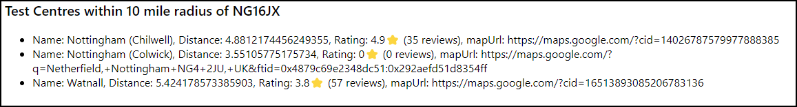

Try it out with your own postcode and different radiuses!

### Showing the results as a table
While our pass rates page does show the correct results, it's not very pretty.  
Let's add a table instead to render the data.  

To do this, let's add a new field `ResultsTable.tsx` to our `components` directory, which should contain the following:
```tsx
import * as React from 'react';
import Box from '@mui/material/Box';
import Table from '@mui/material/Table';
import TableBody from '@mui/material/TableBody';
import TableCell from '@mui/material/TableCell';
import TableContainer from '@mui/material/TableContainer';
import TableHead from '@mui/material/TableHead';
import TableRow from '@mui/material/TableRow';
import TableSortLabel from '@mui/material/TableSortLabel';
import Paper from '@mui/material/Paper';
import {visuallyHidden} from '@mui/utils';
import {TestCentreWithDistance} from "../lib/TestCentre";
import {Tooltip} from "@mui/material";
import HelpIcon from '@mui/icons-material/HelpOutline';
import MapIcon from '@mui/icons-material/Map';

interface Data {
    name: string
    passRate: number
    rating: string
    distance: number
    mapURL: string
}

function descendingComparator<T>(a: T, b: T, orderBy: keyof T) {
    if (b[orderBy] < a[orderBy]) {
        return -1;
    }
    if (b[orderBy] > a[orderBy]) {
        return 1;
    }
    return 0;
}

type Order = 'asc' | 'desc';

function getComparator<Key extends keyof any>(
    order: Order,
    orderBy: Key,
): (
    a: { [key in Key]: number | string },
    b: { [key in Key]: number | string },
) => number {
    return order === 'desc'
        ? (a, b) => descendingComparator(a, b, orderBy)
        : (a, b) => -descendingComparator(a, b, orderBy);
}

// This method is created for cross-browser compatibility, if you don't
// need to support IE11, you can use Array.prototype.sort() directly
function stableSort<T>(array: readonly T[], comparator: (a: T, b: T) => number) {
    const stabilizedThis = array.map((el, index) => [el, index] as [T, number]);
    stabilizedThis.sort((a, b) => {
        const order = comparator(a[0], b[0]);
        if (order !== 0) {
            return order;
        }
        return a[1] - b[1];
    });
    return stabilizedThis.map((el) => el[0]);
}

interface HeadCell {
    disablePadding: boolean;
    id: keyof Data;
    label: string;
    numeric: boolean;
}

const headCells: readonly HeadCell[] = [
    {
        id: 'name',
        numeric: false,
        disablePadding: true,
        label: 'Test Centre',
    },
    {
        id: 'passRate',
        numeric: true,
        disablePadding: true,
        label: 'Pass Rate',
    },
    {
        id: 'rating',
        numeric: true,
        disablePadding: true,
        label: 'Rating'
    },
    {
        id: 'distance',
        numeric: true,
        disablePadding: true,
        label: 'Distance (miles)',
    }
];

interface EnhancedTableProps {
    onRequestSort: (event: React.MouseEvent<unknown>, property: keyof Data) => void;
    order: Order;
    orderBy: string;
    rowCount: number;
}

function EnhancedTableHead(props: EnhancedTableProps) {
    const {order, orderBy, onRequestSort} =
        props;
    const createSortHandler =
        (property: keyof Data) => (event: React.MouseEvent<unknown>) => {
            onRequestSort(event, property);
        };

    return (
        <TableHead>
            <TableRow>
                {headCells.map((headCell) =>
                    (<TableCell
                            key={headCell.id}
                            align={headCell.numeric ? 'right' : 'left'}
                            sortDirection={orderBy === headCell.id ? order : false}
                        >
                            <TableSortLabel
                                active={orderBy === headCell.id}
                                direction={orderBy === headCell.id ? order : 'asc'}
                                onClick={createSortHandler(headCell.id)}
                            >
                                {headCell.label !== 'Rating' ?
                                    headCell.label : <>{'Rating'} <Tooltip
                                        title="Ratings from Google"><HelpIcon sx={{ml: 1}}/></Tooltip></>}
                                {orderBy === headCell.id ? (
                                    <Box component="span" sx={visuallyHidden}>
                                        {order === 'desc' ? 'sorted descending' : 'sorted ascending'}
                                    </Box>
                                ) : null}
                            </TableSortLabel>
                        </TableCell>
                    ))}
            </TableRow>
        </TableHead>
    );
}

interface ResultsTableProps {
    results: TestCentreWithDistance[]
}

export default function ResultsTable({results}: ResultsTableProps) {
    const [order, setOrder] = React.useState<Order>('desc');
    const [orderBy, setOrderBy] = React.useState<keyof Data>('passRate');

    const r = results.map(result => {
        return {
            name: result.name, passRate: result.passRate,
            rating: result.mapDetails.rating ? `${result.mapDetails.rating}⭐ (${result.mapDetails.userRatingsTotal} reviews)` : ``,
            mapURL: result.mapDetails.url,
            distance: result.distance
        };
    })

    const handleRequestSort = (
        event: React.MouseEvent<unknown>,
        property: keyof Data,
    ) => {
        const isAsc = orderBy === property && order === 'asc';
        setOrder(isAsc ? 'desc' : 'asc');
        setOrderBy(property);
    };

    return (
        <>
            <TableContainer component={Paper}>
                <Table
                    size={"medium"}
                    aria-labelledby="tableTitle"
                    style={{ tableLayout: 'auto' }}
                    padding={'normal'}

                >
                    <EnhancedTableHead
                        order={order}
                        orderBy={orderBy}
                        onRequestSort={handleRequestSort}
                        rowCount={results.length}
                    />
                    <TableBody>
                        {/* if you don't need to support IE11, you can replace the `stableSort` call with:
              rows.slice().sort(getComparator(order, orderBy)) */}
                        {stableSort(r, getComparator(order, orderBy))
                            .map((row) => {
                                return (
                                    <TableRow
                                        hover
                                        tabIndex={-1}
                                        key={row.name}
                                    >
                                        <TableCell>{row.name}<MapIcon onClick={() => window.open(row.mapURL)}/></TableCell>
                                        <TableCell align="right">{row.passRate}%</TableCell>
                                        <TableCell align="right">{row.rating}</TableCell>
                                        <TableCell
                                            align="right">{Math.round((row.distance + Number.EPSILON) * 100) / 100}</TableCell>
                                    </TableRow>
                                );
                            })}
                    </TableBody>
                </Table>
            </TableContainer>
        </>
    );
}
```
There's a lot of code in this file, however you should note that a lot of it is copied from the "Sorting & Selecting" example given for tables in Material UI [here](https://mui.com/material-ui/react-table/#sorting-amp-selecting).  
The most important section to focus on is the tsx returned from the function, showing how our table is rendered and with what cells and rows.  
The table contains functionality for the user to sort by each column, and each column contains a map icon, linking the user to the test centre on Google Maps.

Navigating to http://localhost:3000/pass-rates?postcode=NG16JX&radius=10 now shows us a table:  
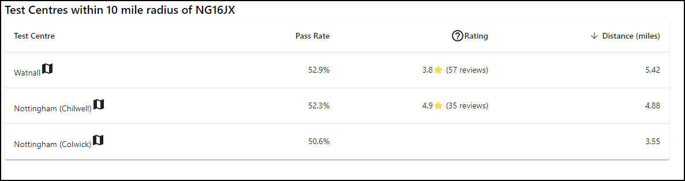


## Adding search functionality to the landing page
The next requirement to focus on is to allow users to search for their nearest test centres from the landing page.  
To do this, we'll add a text field for the postcode, and a dropdown for the radius.

We'll start by adding a new component under our `component` directory called `Search.tsx`. This will contain the search elements we just described, with a submit button that will navigate the user to our pass rates page.
`Search.tsx` should contain the following:
```tsx
import {Box} from "@mui/system";
import {Button} from "@mui/material";
import Paper from "@mui/material/Paper";
import React, {useEffect, useState} from "react";
import {useRouter} from "next/router";


export default function Search({initialPostcode, initialRadius}:any) {
    const router = useRouter()
    const [postcode, setPostcode] = useState<string | null>(null);
    const [radius, setRadius] = useState<number>(10);

    useEffect(() => {
        setPostcode(initialPostcode);
        setRadius(initialRadius)
    }, [initialPostcode, initialRadius])

    function handleSubmit() {
        router.push(`/pass-rates?postcode=${postcode}&radius=${radius}`);
    }

    return (
        <Paper variant="outlined" sx={{p: 1}}>
            <div style={{display: 'flex', flexFlow: 'row wrap'}}>
                <Box sx={{m: 1, flex: 1}}>
                    <TextField label="Postcode" value={postcode} onChange={e => setPostcode(e.target.value)}/>
                </Box>
                <FormControl sx={{m: 1, minWidth: 120, flex: 1}}>
                    <InputLabel id="demo-simple-select-label">Radius</InputLabel>
                    <Select
                        labelId="demo-simple-select-label"
                        id="demo-simple-select"
                        value={radius}
                        label="Age"
                        onChange={e => setRadius(e.target.value as number)}
                    >
                        <MenuItem value={5}>5 miles</MenuItem>
                        <MenuItem value={10}>10 miles</MenuItem>
                        <MenuItem value={20}>20 miles</MenuItem>
                        <MenuItem value={30}>30 miles</MenuItem>
                    </Select>
                </FormControl>

                <Box sx={{m: 1, mt: 1.8, flex: 1, display: 'flex', flexDirection: 'column'}}>
                    <Button sx={{alignSelf: 'center'}} variant="outlined" onClick={handleSubmit}  size="large">Search</Button>
                </Box>

            </div>


        </Paper>
    );
}
```
Here we can see that we have a `TextField` for the postcode and a dropdown for the radius. Navigating to http://localhost:8000 shows us these new search fields:  
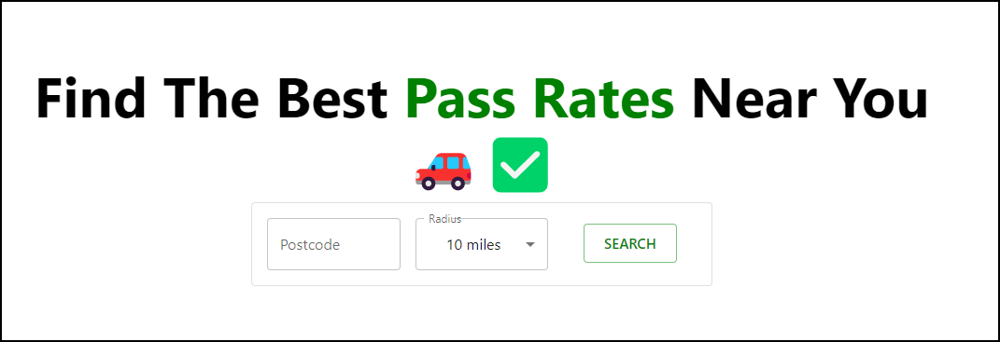

Try entering a postcode and clicking search, it will bring you to the pass rates page.

### Adding autocomplete to our postcode search
Currently, we have no validation for postcodes in our search component. One way that we can validate postcodes is to use [postcodes.io](https://postcodes.io/) again.  
We can call postcodes.io to check if the entered postcode is a real postcode. Even better, postcodes.io offers an autocomplete endpoint which we can use to show an autocomplete dropdown.  

We'll add the following to the `PostcodesAPI.ts` file:
```ts
export async function getPostcodeSuggestions(partial: string) {
  return (await getPostcodeAutocompleteResponse(partial))?.result;
}

const getPostcodeAutocompleteResponse = async (partial: string) : Promise<PostcodeAutocompleteResponseDTO | null> => {
  return await fetch(`${baseUrl}${partial}/autocomplete`, {
    headers: {
      'Content-Type': 'application/json',
      'Accept': 'application/json'
    }
  }).then(response => {
    return response.json();
  }).catch(error => {
    console.error(error);
    return null;
  })
}

export const isValidPostcode = async (postcode: string) : Promise<boolean> => {
  return await fetch(`${baseUrl}${postcode}`, {
    headers: {
      'Content-Type': 'application/json',
      'Accept': 'application/json'
    }
  }).then(response => {
    return response.ok;
  }).catch(error => {
    console.error(error);
    return false;
  })
}

interface PostcodeAutocompleteResponseDTO {
  result: string[]
}
```
We have added:
1. `getPostcodeSuggestions()`, which calls Postcodes.io's autocomplete endpoint to get the autocomplete suggestions.
2. `isValidPostcode()`, which checks that the passed in postcode is a valid postcode

Install:
```shell
npm install lodash
npm install @types/lodash
```

We then need to create a new component, `PostcodeAutocomplete.tsx` in the `components` directory which will replace the postcode `TextField` element in the `Search` component with an `Autocomplete` element. Firstly, we'll need to install lodash.  
Run the following:
```shell
npm install lodash
npm install @types/lodash
```

Then, add the following to `PostcodeAutocomplete.tsx`:
```tsx
import * as React from 'react';
import {useCallback, useEffect} from 'react';
import Box from '@mui/material/Box';
import TextField from '@mui/material/TextField';
import Autocomplete, {AutocompleteRenderInputParams} from '@mui/material/Autocomplete';
import LocationOnIcon from '@mui/icons-material/LocationOn';
import Grid from '@mui/material/Grid';
import debounce from 'lodash/debounce';
import {getPostcodeSuggestions} from "./PostcodesAPI";
import {CircularProgress} from "@mui/material";

export const getOptionsAsync = (query: string): Promise<string[]> => {
    if(!query) return Promise.resolve([]);
    return getPostcodeSuggestions(query).then(suggestions => suggestions ? suggestions : []);
};

interface PostcodeAutocompleteProps {
    setPostcode: (s: string | null) => void
    postcodeError: boolean
    setPostcodeError: (b: boolean) => void
    submitForm: () => void
    postcode: string | null
}

export default function PostcodeAutocomplete({
                                                 setPostcode,
                                                 postcodeError,
                                                 setPostcodeError,
                                                 submitForm,
                                                 postcode
                                             }: PostcodeAutocompleteProps,) {
    const [options, setOptions] = React.useState<string[]>([]);
    const [value, setValue] = React.useState<string | null>(postcode);
    const [searchQuery, setSearchQuery] = React.useState<string>("");
    const [isLoading, setIsLoading] = React.useState<boolean>(false);

    const getOptionsDelayed = useCallback(
        debounce((query: string, callback: (options: string[]) => void) => {
            setOptions([]);
            getOptionsAsync(query).then(callback);
        }, 300),
        []
    );

    useEffect(() => {
        setValue(postcode);
    }, [postcode])

    useEffect(() => {
        setIsLoading(true);

        getOptionsDelayed(searchQuery, (options: string[]) => {
            setOptions(options);

            setIsLoading(false);
        });
    }, [searchQuery, getOptionsDelayed]);

    const onChange = (event: unknown, value: string | null) => {
        setValue(value);
        setPostcode(value);
        setPostcodeError(false);
    };

    const onInputChange = (event: unknown, value: string) => {
        setSearchQuery(value);
        setPostcode(value);
        setPostcodeError(false);
    };

    const keyPress = (e: React.KeyboardEvent<HTMLDivElement>) => {
        if (e.key == 'Enter') {
            submitForm()
        }
    }

    const renderInput = (
        params: AutocompleteRenderInputParams
    ): React.ReactNode => {
        return (
            <TextField {...params} label="Postcode" InputProps={{
                ...params.InputProps,
                endAdornment: (
                    <React.Fragment>
                        {isLoading ? <CircularProgress color="inherit" size={20}/> : null}
                        {params.InputProps.endAdornment}
                    </React.Fragment>
                ),
            }}
                       error={postcodeError}
                       helperText={postcodeError ? "Not a valid postcode" : ""}
                       onKeyDown={keyPress}/>
        );
    };

    return (
        <Autocomplete
            options={options}
            value={value}
            onChange={onChange}
            onInputChange={onInputChange}
            renderInput={renderInput}
            loading={isLoading}
            filterOptions={x => x}
            freeSolo
            sx={{minWidth: 140}}
            renderOption={(props, option) => {

                return (
                    <li {...props}>
                        <Grid container alignItems="center">
                            <Grid item>
                                <Box
                                    component={LocationOnIcon}
                                    sx={{color: 'text.secondary', mr: 2}}
                                />
                            </Grid>
                            <Grid item xs>
                                {option}
                            </Grid>
                        </Grid>
                    </li>
                );
            }}
        />
    );
}
```
Here we're using Material UI's Autocomplete component.
The things to notice here:
1. We use Lodash's debounce so that we only call Postcodes.io's API when there has been a gap of 300 ms between the user typing the postcode. We use the data returned here to populate the options for the autocomplete dropdown.
2. The functions to set the value and the error for validation is handled by the parent component (which we'll see below).
3. If the error prop is true, then we will show the text field as red and tell the user that this is not a valid postcode.

Next, we update the `Search.tsx` component to use our new `PostcodeAutocomplete` component. Replace the entire component with the following:
```tsx
export default function Search({initialPostcode, initialRadius}:any) {
    const router = useRouter()
    const [postcode, setPostcode] = useState<string | null>(null);
    const [radius, setRadius] = useState<number>(10);
    const [postcodeError, setPostcodeError] = useState(false);

    useEffect(() => {
        setPostcode(initialPostcode);
        setRadius(initialRadius)
    }, [initialPostcode, initialRadius])

    function handleSubmit() {
        if (!postcode) setPostcodeError(true)
        else isValidPostcode(postcode)
            .then(isValid => {
                setPostcodeError(!isValid);
                if (isValid) router.push(`/pass-rates?postcode=${postcode}&radius=${radius}`)
            });
    }

    return (
        <Paper variant="outlined" sx={{p: 1}}>
            <div style={{display: 'flex', flexFlow: 'row wrap'}}>
                <Box sx={{m: 1, flex: 1}}>
                    <PostcodeAutocomplete postcode={postcode} setPostcode={setPostcode} postcodeError={postcodeError}
                                          setPostcodeError={setPostcodeError} submitForm={handleSubmit}/>
                </Box>
                <FormControl sx={{m: 1, minWidth: 120, flex: 1}}>
                    <InputLabel id="demo-simple-select-label">Radius</InputLabel>
                    <Select
                        labelId="demo-simple-select-label"
                        id="demo-simple-select"
                        value={radius}
                        label="Age"
                        onChange={e => setRadius(e.target.value as number)}
                    >
                        <MenuItem value={5}>5 miles</MenuItem>
                        <MenuItem value={10}>10 miles</MenuItem>
                        <MenuItem value={20}>20 miles</MenuItem>
                        <MenuItem value={30}>30 miles</MenuItem>
                    </Select>
                </FormControl>

                <Box sx={{m: 1, mt: 1.8, flex: 1, display: 'flex', flexDirection: 'column'}}>
                    <Button sx={{alignSelf: 'center'}} variant="outlined" onClick={handleSubmit}  size="large">Search</Button>
                </Box>

            </div>


        </Paper>
    );
}
```
We have changed the following:
1. We've added a new state variable, postcodeError, to handle whether the entered postcode is valid, which gets passed to the `PostcodeAutocomplete` component.
2. We validate the postcode in the `handleSubmit()` method by calling the `isValidPostcode()` method in `PostcodesAPI`.

Let's test our changes!  
Go to http://localhost:3000 and try entering a post code into the landing page.
You should see something like this:  
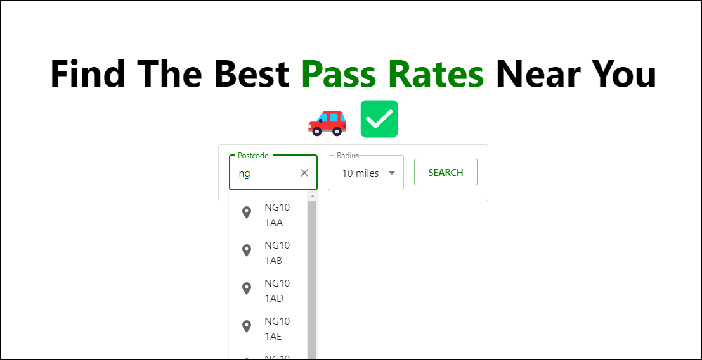

Clicking on one of the postcodes will autofill the postcode for you.

### Adding search functionality to the Pass Rates page
A nice extra feature would be to allow the user to search for a new postcode from the Pass Results page without having to go back to the landing page.  
As we've got Search and PostcodeAutocomplete in their own components we can easily add this.  
replace the return block in `pass-rates.tsx` with the following:
```tsx
return (
    <>
        <Head>
            <meta charSet="utf-8"/>
            <title>Best Driving Test Pass Rates Near Me - Pass Rates</title>
            <meta name="description" content={`Shows the latest pass rates for driving test centres near ${postcode} within a ${radius} mile radius`}/>
        </Head>
        <Box sx={{display: 'flex', justifyContent: 'center', mt: 1, mb: 1}}>
            <Search initialPostcode={postcode} initialRadius={radius}/>
        </Box>
        
        <Typography variant="h6">Test Centres within {radius} mile radius of {postcode}</Typography>

        <ResultsTable results={results}/>
    </>
);
```
The only thing we've changed here is that we've added our `Search` component. 
We initially populate the postcode and radius fields with the previous search's parameters.

The Pass Rates page should now look like this:  
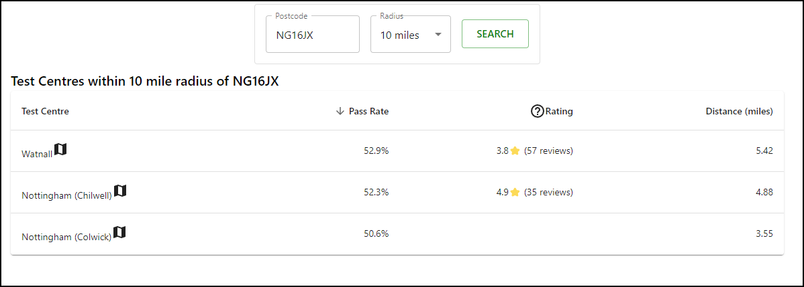

## Showing results for each city
One of the requirements is for users to be able to select the best test centres near a city.  
One of the benefits of doing this is for SEO. We will create static pages for each city, which can be reached at `/pass-rates/<city name>`.  
This means that Google can easily index these pages and return them when someone searches for the best driving test centres near a city.  
You might have noticed that other websites do something similar to this, where they create static pages for commonly searched criteria to increase their chances of appearing at the top of Google's search results (amongst other benefits).  
One example of this is crontab.guru, which has static pages for commonly used cron expressions, e.g. every 5 minutes, which can be found at [https://crontab.guru/every-5-minutes](https://crontab.guru/every-5-minutes).

To implement this, we need to know:
- The list of cities
- the nearest test centres are near each city

We'll first start with getting the nearest test centres to each city.

### Getting the location data for each city
To calculate the nearest test centres to each city we need to know the latitude and logitude of each city.

To calculate the location of each city I took a list of all the cities in the UK off [wikipedia](https://en.wikipedia.org/wiki/List_of_cities_in_the_United_Kingdom), and then searched for each city using the google maps APIs like we did before.

So taking an example of Birmingham, calling:
https://maps.googleapis.com/maps/api/place/findplacefromtext/json?input=Birmingham&inputtype=textquery&key=<YOUR API KEY>&locationbias=ipbias&fields=name,place_id
returns
```json
{
  "candidates": [
    {
      "name": "Birmingham",
      "place_id": "ChIJc3FBGy2UcEgRmHnurvD-gco"
    }
  ],
  "status": "OK"
}
```
We can then take the place ID to get the latitude and longitude:
https://maps.googleapis.com/maps/api/place/details/json?place_id=ChIJc3FBGy2UcEgRmHnurvD-gco&key=<YOUR API KEY>&fields=geometry
Which returns:
```json
{
  "html_attributions": [],
  "result": {
    "geometry": {
      "location": {
        "lat": 52.48624299999999,
        "lng": -1.890401
      },
      "viewport": {
        "northeast": {
          "lat": 52.60869933491674,
          "lng": -1.709829372653529
        },
        "southwest": {
          "lat": 52.38599896742283,
          "lng": -2.017433632448159
        }
      }
    }
  },
  "status": "OK"
}
```

To figure out which test centres are near each city we first need to decide on what distance we consider "close". I considered anything within a 10-mile radius close.    
For each city we can go through each test centre, calculate the distance between the city and the test centre, and if the distance is less than 10 miles then we add that test centre to the list of close test centres.

To calculate the distance we can use the [Haversine formula](https://en.wikipedia.org/wiki/Haversine_formula), like we did before in the `pass-rates.tsx` component.

You'll want to save each city with its closest test centres in individual JSON files. Each json file should be the name of city, in a directory called `cities`.   
E.g. you'll have a file called `birmingham.json` that looks like this:
```json
{
  "name": "Birmingham",
  "postcode": "B4 7DL",
  "testCentres": [
    {
      "name": "Birmingham (Garretts Green)",
      "passRate": "43.6",
      "distance": 4.767003603076919,
      "mapDetails": {
        "placeId": "ChIJldK_AICwcEgR2-SLap5P9Nw",
        "address": "Granby Ave, Garrett's Green, Birmingham B33 0SJ, United Kingdom",
        "name": "Garretts Green Test Centre",
        "lat": 52.4759864,
        "lng": -1.7783739,
        "rating": 3.7,
        "url": "https://maps.google.com/?cid=15921438124472526043",
        "userRatingsTotal": 58
      }
    },
    {
      "name": "Birmingham (Kings Heath)",
      "passRate": "42.1",
      "distance": 5.493458409608323,
      "mapDetails": {
        "placeId": "ChIJD1VCmci-cEgR77E87hMKPNg",
        "address": "955 Alcester Rd S, Birmingham B14 5JA, United Kingdom",
        "name": "Birmingham Kings Heath Driving Test Centre",
        "lat": 52.4067573,
        "lng": -1.8873253,
        "rating": 3.6,
        "url": "https://maps.google.com/?cid=15581339891512685039",
        "userRatingsTotal": 81
      }
    },
    {
      "name": "Birmingham (Kingstanding)",
      "passRate": "36.7",
      "distance": 4.000310419795066,
      "mapDetails": {
        "placeId": "ChIJHbuU-WOjcEgRtqaHZnumMto",
        "address": "205 Birdbrook Rd, Birmingham B44 9UL, United Kingdom",
        "name": "Birmingham Kingstanding Driving Test Centre",
        "lat": 52.5441402,
        "lng": -1.890445,
        "rating": 3.9,
        "url": "https://maps.google.com/?cid=15722812298035177142",
        "userRatingsTotal": 116
      }
    },
    {
      "name": "Birmingham (Shirley)",
      "passRate": "52.2",
      "distance": 6.287245676525351,
      "mapDetails": {
        "placeId": "ChIJWaNhJae5cEgRb7RLuTDHiaE",
        "address": "374 Stratford Rd, Shirley, Solihull B90 4AQ, United Kingdom",
        "name": "Shirley Driving Test Centre",
        "lat": 52.4051825,
        "lng": -1.8225654,
        "rating": 3.7,
        "url": "https://maps.google.com/?cid=11640053723996861551",
        "userRatingsTotal": 44
      }
    },
    {
      "name": "Birmingham (South Yardley)",
      "passRate": "36.7",
      "distance": 4.019107914150748,
      "mapDetails": {
        "placeId": "ChIJHUTeU0e6cEgRM9dvMwTt1sw",
        "address": "Driving Test Centre, Clay Ln, Birmingham B26 1EA, UK",
        "name": "Driving Test Centre",
        "lat": 52.45498449999999,
        "lng": -1.8098702,
        "rating": 0.0,
        "url": "https://maps.google.com/?q=Driving+Test+Centre&ftid=0x4870ba4753de441d:0xccd6ed04336fd733",
        "userRatingsTotal": 0
      }
    },
    {
      "name": "Birmingham (Sutton Coldfield)",
      "passRate": "36.5",
      "distance": 5.679981743492782,
      "mapDetails": {
        "placeId": "ChIJ7cilVwKlcEgRZ64gPe1-Icw",
        "address": "31-33 Birmingham Rd, Sutton Coldfield B72 1QE, United Kingdom",
        "name": "DVSA Theory Test Centre",
        "lat": 52.558625,
        "lng": -1.826348,
        "rating": 3.0,
        "url": "https://maps.google.com/?cid=14709177415366651495",
        "userRatingsTotal": 23
      }
    },
    {
      "name": "Birmingham (Wyndley)",
      "passRate": "54.5",
      "distance": 4.687979677729207,
      "mapDetails": {
        "placeId": "ChIJZQwbgeSkcEgR6650dA7bWpo",
        "address": "110-116 Boldmere Rd, Boldmere, Sutton Coldfield B73 5UB, UK",
        "name": "110-116 Boldmere Rd",
        "lat": 52.5471217,
        "lng": -1.8411731,
        "rating": 0.0,
        "url": "https://maps.google.com/?q=110-116+Boldmere+Rd,+Boldmere,+The+Royal+Town+of+Sutton+Coldfield,+Sutton+Coldfield+B73+5UB,+UK&ftid=0x4870a4e4811b0c65:0x9a5adb0e7474aeeb",
        "userRatingsTotal": 0
      }
    },
    {
      "name": "Wednesbury",
      "passRate": "39.6",
      "distance": 7.032517930498278,
      "mapDetails": {
        "placeId": "ChIJm07r2l-YcEgRVY5l3eqVSg8",
        "address": "Knowles St, Wednesbury WS10 9HN, United Kingdom",
        "name": "DVSA Driving Test Centre",
        "lat": 52.5555689,
        "lng": -2.0128767,
        "rating": 2.8,
        "url": "https://maps.google.com/?cid=1101857894814813781",
        "userRatingsTotal": 85
      }
    }
  ]
}
```

and another called `aberdeen.json` that looks like this:
```json
{
  "name": "Aberdeen",
  "postcode": "AB24 5BA",
  "testCentres": [
    {
      "name": "Aberdeen North",
      "passRate": "57.3",
      "distance": 2.4724386179137534,
      "mapDetails": {
        "placeId": "ChIJC3xww_sNhEgR7iXmPVZSNVA",
        "address": "8GT, Balgownie Rd, Bridge of Don, Aberdeen, United Kingdom",
        "name": "DVSA",
        "lat": 57.1856443,
        "lng": -2.0964023,
        "rating": 4.1,
        "url": "https://maps.google.com/?cid=5779616227159057902",
        "userRatingsTotal": 7
      }
    },
    {
      "name": "Aberdeen South (Cove)",
      "passRate": "64.5",
      "distance": 4.274066387101663,
      "mapDetails": {
        "placeId": "ChIJTY7RiP4PhEgRDr0PT-qctJE",
        "address": "Moss Rd, Aberdeen AB12 3GQ, United Kingdom",
        "name": "DVSA Driving Test Centre",
        "lat": 57.0884979,
        "lng": -2.1077442,
        "rating": 4.3,
        "url": "https://maps.google.com/?cid=10499189161470180622",
        "userRatingsTotal": 19
      }
    }
  ]
}
```

### Generate results
The first thing we'll do is create the necessary lib function to get all the city names. We can do this in a similar way to how we got all of the test centre data.  
Create a file called `cities.ts` in the `lib` directory. This should contain the following:
```ts
import fs from 'fs';
import path from 'path';

const citiesDirectory = path.join(process.cwd(), 'cities');

export function getAllCityIds() {
    const fileNames = fs.readdirSync(citiesDirectory);

    return fileNames.map((fileName) => {
        return fileName.replace(/\.json$/, '');
    });
}
```
Here we expose a method which returns the name of all cities based on the json files that we saved in the `cities` directory in the previous step.

We can then create a new page to show all the cities. Create a new file, `cities.tsx` under the `pages` directory. This should contain the following:
```tsx
import {Box, Typography} from "@mui/material";
import {getAllCityIds} from "../lib/cities";
import Head from "next/head";
import React from "react";


export async function getStaticProps() {
    const cityIds = getAllCityIds();
    return {
        props: {
            cityIds,
        },
    };
}

interface CitiesProps {
    cityIds: string[]
}


function capitalizeFirstLetter(string: string) {
    return string.split(" ").map(word => word.charAt(0).toUpperCase() + word.slice(1)).join(" ")
}


export default function cities({cityIds}: CitiesProps) {
    return (
        <>
            <Head>
                <meta charSet="utf-8"/>
                <title>Best Driving Test Pass Rates Near Me - Pass Rates</title>
                <meta name="description"
                      content={`A list of all the cities in the UK, each linking to the latest pass rates for driving centres in that area.`}/>
            </Head>
            <Box sx={{display: 'flex', flexDirection: 'column'}}>
                <Typography variant="h2">Cities</Typography>
                <ul>
                    {cityIds.map(id => <li key={id}>{capitalizeFirstLetter(id)}</li>)}
                </ul>
            </Box>
        </>
    )
}
```

Here we load the city names as static props (so on build time), and generate a list containing each city name.

We can then navigate to `http://localhost:3000/cities` and we will be shown a list of all the cities we imported:  
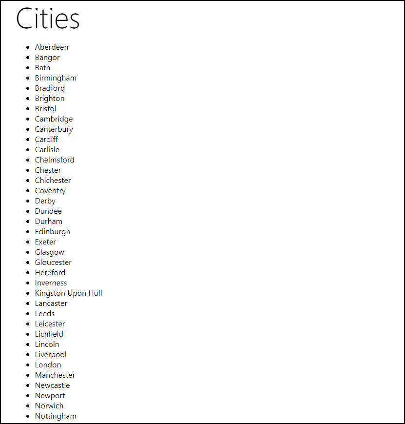

### Create a page for each city
Now that we have the list, we need to link each city to a page showing the nearest test centres.  

We want to be able to statically generate a page for each city that we have JSON for in our `cities` directory.  
To do this, we can use NextJS's `getStaticPaths()` function. `getStaticPaths` allows us to specify a list, which is then converted into a page per element in the list.  

To see this in action, let's add our page.  
The first thing we need to do however is generate the list of city names.  
In the `cities.ts` file in the `lib` directory, add the following function:
```ts
export function getAllCityPaths() {
  const fileNames = fs.readdirSync(citiesDirectory);

  return fileNames.map((fileName) => {
    return {
      params: {
        id: fileName.replace(/\.json$/, ''),
      },
    };
  });
}
```
This function reads the `cities` directory and generates a list of all city names, stored as the `id` field.

We then need to create a directory called `pass-rates` under the `pages` directory, and then create a file called `[id].tsx` under the `pass-rates` directory. It is 
important that the square brackets are included in the name, as that tells NextJS that we want the page name to be derived from the 
list passed to `getStaticPaths`.  
Inside the `[id].tsx` file add the following:
```tsx
import {getAllCityPaths} from "../../lib/cities";
import React from "react";

export default function City({id}: any) {
  return <>
    {id}
  </>;
}

export async function getStaticPaths() {
  const paths = getAllCityPaths();
  return {
    paths,
    fallback: false,
  };
}

export async function getStaticProps({params}: any) {
  const id = params.id;
  return {
    props: {
      id
    }
  }
}
```
Here we are:
1. Using `getStaticPaths` to create a page for each city name
2. setting the city name in the props using `getStaticProps`
3. Printing out the city name

As we placed out `[id].tsx` file under the `pass-rates` directory, any generated page will be found at `/pass-rates/<page>`.

Let's test this out! 
Try navigating to the generated page for Birmingham. Go to `http://localhost:3000/pass-rates/birmingham` and you should see a page showing the city name:  
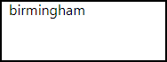

#### Show the pass rates for each city
Now that we have the generated pages, lets populate each of them with the nearest test centre data.  

First, we'll need to add another function to `cities.ts` in the `lib` directory to get the data for each city. Add the following function:
```ts
export function getCityData(id: string) {
  const fullPath = path.join(citiesDirectory, `${id}.json`);
  const fileContents = JSON.parse(fs.readFileSync(fullPath, 'utf8'));
  // Combine the data with the id
  return {
    id,
    ...fileContents,
  };
}
```

Next, let's change the `getStaticProps` function to get the cityData, and then change the React component to render the results. 
Replace `[id].tsx` completely with the following:
```tsx
import {getAllCityPaths, getCityData} from "../../lib/cities";
import React from "react";
import Head from "next/head";
import {Box} from "@mui/system";
import ResultsTable from "../../components/ResultsTable";
import Search from "../../components/Search";
import {Typography} from "@mui/material";

export default function City({cityData}:any) {
  return <>
    <Head>
      <meta charSet="utf-8"/>
      <title>Best Driving Test Pass Rates Near {cityData.name}</title>
      <meta name="description" content={`Shows the latest pass rates for driving test centres near ${cityData.name} within a 10 mile radius`}/>
      <link rel="canonical" href={`https://drivingpassrate.co.uk/pass-rates/${cityData.name}`}/>
    </Head>
    <Box sx={{display: 'flex', justifyContent: 'center', mt: 1, mb: 1}}>
      <Search initialPostcode={cityData?.postcode} initialRadius={10}/>
    </Box>

    <Typography variant="h6" >Test Centres within 10 mile radius of {cityData.name}</Typography>

    <ResultsTable results={cityData.testCentres}/>
  </>;
}

export async function getStaticPaths() {
  const paths = getAllCityPaths();
  return {
    paths,
    fallback: false,
  };
}

export async function getStaticProps({ params }:any) {
  const cityData = getCityData(params.id);
  return {
    props: {
      cityData
    }
  }
}
```
What we've changed:
1. we call `getCityData` in `getStaticProps` to load the test centre data for the city and add it to props.
2. We render the search component with the city's postcode
3. We pass in the nearest test centre data to the `<ResultsTable/>` component to render the table.

Going to `http://localhost:3000/pass-rates/birmingham` will now show a page very similar to the Page Rates page:  
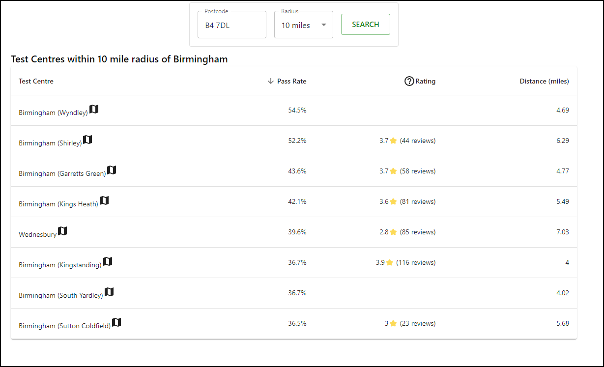

### Link each city name to its own page from /cities
The next step is to go back to the `/cities` page and link every city name to its own individual page so that users can find them.  

Open the `cities.tsx` file under `pages` and replace the React component with the following:
```tsx
export default function cities({cityIds}: CitiesProps) {
  return (
          <>
            <Head>
              <meta charSet="utf-8"/>
              <title>Best Driving Test Pass Rates Near Me - Pass Rates</title>
              <meta name="description"
                    content={`A list of all the cities in the UK, each linking to the latest pass rates for driving centres in that area.`}/>
            </Head>
            <Box sx={{display: 'flex', flexDirection: 'column'}}>
              <Typography variant="h2">Cities</Typography>
              <Box>
                {cityIds.map(id => {
                  return (
                          <Link href={`/pass-rates/${id}`} passHref key={id} style={{textDecoration: 'none', color: 'inherit'}}>
                            <ListItemButton >
                              <ListItemText primary={capitalizeFirstLetter(id)}/>
                            </ListItemButton>
                          </Link>)
                })
                }
              </Box>
            </Box>
          </>
  )
}
```
What we've changed:
1. We've changed each city name into a button that links to the corresponding city page

Going to `http://localhost:3000/cities` will now show the following:
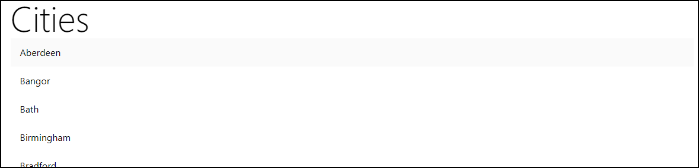

Clicking on any city will now bring you to that cities page. E.g. clicking on the Birmingham button will bring you to `http://localhost:3000/pass-rates/birmingham`.  
You might notice that it's slow to render the city pages. This is because Next.js is rendering the pages on the fly at runtime when running the app in dev mode. When the application
is deployed in production mode it will be much faster as each page will be statically rendered at build time.

### Add link on landing page
Finally, let's add a link to our `/cities` page from the landing page.

Open `index.tsx` and add the following under the `<Search/>` element:
```tsx
<Box sx={{m: 2, mt: 1.8, display: 'flex', flexDirection: 'column'}}>
  <Link href={`/cities`} passHref>
    <Button sx={{alignSelf: 'center'}} variant="outlined" component="a">See all cities</Button>
  </Link>
</Box>
```

Going to `http://localhost:3000` will now show the following:
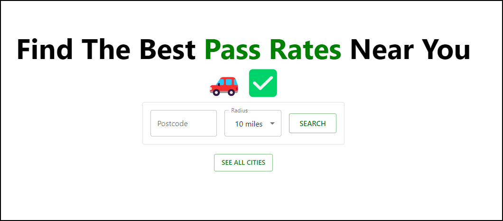

## Adding the finishing touches
if we want to deploy this application to the public then there are a few finishing touches that we can add to make it more professional.  
We'll go over these in this section.

### Adding an icon
Right now when you open your application at `http://localhost:3000` you'll notice that the favicon (the little icon that appears on the tab in your browser) 
is set to NextJS.s logo.  
We should change this to be the icon for our website.  

There are many places to get free assets, but one place that I have used is [flaticon.com](https://www.flaticon.com). 
For this website we'll use the icon found [here](https://www.flaticon.com/free-icon/pass_1633103?term=exam+pass&page=1&position=4&origin=search&related_id=1633103).  
Favicons have a size of 32x32, so download the icon as a 32x32 png.  
To use this as a favicon we need to have it as a `.ico` file. Again, there are numerous ways to do this convertion, one way is [here](https://image.online-convert.com/convert-to-ico).

Once we have our `favicon.ico` file, you need to replace the existing one in the `public` directory.

Once you've done this, go back to `http://localhost:3000`. You should see that the icon has changed on the tab:


### Adding a sitemap and robots.txt
The next thing we'll want to do is add a sitemap and a robots.txt. Sitemaps tell Google (or any search engine) what pages can be crawled on your website. The robots.txt file tells Google how your website should be crawled.  
We can automatically generate these using `next-sitemap`, which will add all of our static pages for us.

First, we must add a file called `next-sitemap.config.js` to the root directory. This file should contain the following:
```js
/** @type {import('next-sitemap').IConfig} */
const config = {
    siteUrl: process.env.SITE_URL || 'https://yourdomainname.com',
    generateRobotsTxt: true, // (optional)
    // ...other options
}
module.exports = config
```
This sets up the config for `next-sitemap`. You'll notice that the site URL defaults to `https://yourdomainname.com`. Leave that as it is for now, we'll come back to that later.

Next, let's add the `next-sitemap` dependency:  
```shell
npm install next-sitemap
```

Next, we must add a `postbuild` step to our `package.json` file to generate the sitemap:
```json
    "build": "next build",
    "postbuild": "next-sitemap",
```

Now, let's generate it! Stop your instance of `npm run dev` if it's still running and run `npm run build`.

Once the build is done you should see that 3 files have been generated in your `public` folder.  
robots.txt:  
```
# *
User-agent: *
Allow: /

# Host
Host: https://yourdomainname.com

# Sitemaps
Sitemap: https://yourdomainname.com/sitemap.xml
```

sitemap.xml:  
```xml
<?xml version="1.0" encoding="UTF-8"?>
<sitemapindex xmlns="http://www.sitemaps.org/schemas/sitemap/0.9">
<sitemap><loc>https://yourdomainname.com/sitemap-0.xml</loc></sitemap>
</sitemapindex>
```

sitemap-0.xml:  
```xml
<?xml version="1.0" encoding="UTF-8"?>
<urlset xmlns="http://www.sitemaps.org/schemas/sitemap/0.9" xmlns:news="http://www.google.com/schemas/sitemap-news/0.9" xmlns:xhtml="http://www.w3.org/1999/xhtml" xmlns:mobile="http://www.google.com/schemas/sitemap-mobile/1.0" xmlns:image="http://www.google.com/schemas/sitemap-image/1.1" xmlns:video="http://www.google.com/schemas/sitemap-video/1.1">
  <url><loc>https://yourdomainname.com</loc><lastmod>2023-04-06T12:36:31.039Z</lastmod><changefreq>daily</changefreq><priority>0.7</priority></url>
  <url><loc>https://yourdomainname.com/cities</loc><lastmod>2023-04-06T12:36:31.039Z</lastmod><changefreq>daily</changefreq><priority>0.7</priority></url>
  <url><loc>https://yourdomainname.com/pass-rates</loc><lastmod>2023-04-06T12:36:31.039Z</lastmod><changefreq>daily</changefreq><priority>0.7</priority></url>
  <url><loc>https://yourdomainname.com/pass-rates/aberdeen</loc><lastmod>2023-04-06T12:36:31.039Z</lastmod><changefreq>daily</changefreq><priority>0.7</priority></url>
  <url><loc>https://yourdomainname.com/pass-rates/bangor</loc><lastmod>2023-04-06T12:36:31.039Z</lastmod><changefreq>daily</changefreq><priority>0.7</priority></url>
  <url><loc>https://yourdomainname.com/pass-rates/bath</loc><lastmod>2023-04-06T12:36:31.039Z</lastmod><changefreq>daily</changefreq><priority>0.7</priority></url>
  <url><loc>https://yourdomainname.com/pass-rates/birmingham</loc><lastmod>2023-04-06T12:36:31.039Z</lastmod><changefreq>daily</changefreq><priority>0.7</priority></url>
...
```

### Making it a Progressive Web App (PWA)
We can quite easily set up our application as a PWA with NextJS. In case you haven't heard of PWAs before you can read about them [here](https://web.dev/learn/pwa/), but the short answer is that 
they allow us to provide a consistent experience across a variety of devices, and allow users to install our web app on their device as if it were a native Android or iOS app.

The first thing we'll do is install `next-pwa`:  
```shell
npm install next-pwa
```
We then need to change our `next.config.js` file to use the `next-pwa` plugin:  
```js
/** @type {import('next').NextConfig} */
const withPWA = require('next-pwa')({
  dest: 'public'
})

const nextConfig = withPWA({
  reactStrictMode: true,
  swcMinify: true,
})

module.exports = nextConfig
```
 
We then need to create our `manifest.json`. 
The easiest way to do this is to generate one using [simicart](https://www.simicart.com/manifest-generator.html/).
Before you do this you'll need to download the icon at size 512 [here](https://www.flaticon.com/free-icon/pass_1633103?term=exam+pass&page=1&position=4&origin=search&related_id=1633103).

Add the following properties to the Simicart manifest generator:
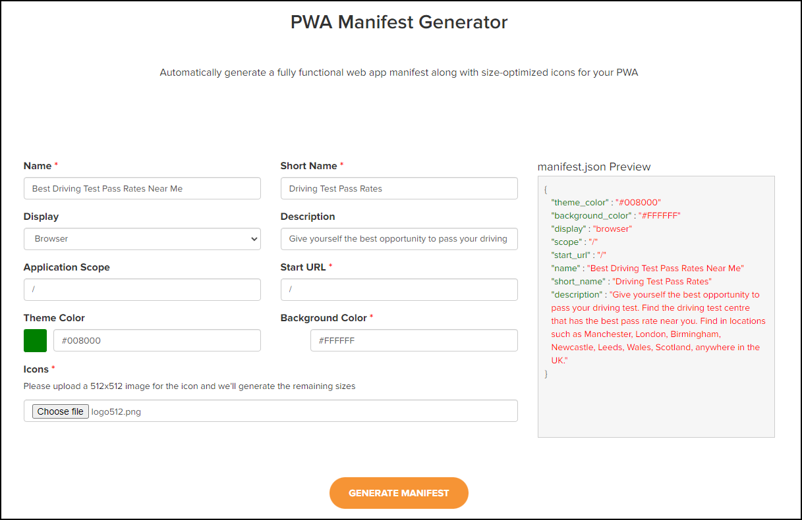

Click "Generate Manifest" and you'll download a zip. Extract this zip to your `public` directory and rename `manifest.webmanifest` to `manifest.json`.  
Your manifest.json should look like this:  
```json
{
  "theme_color": "#008000",
  "background_color": "#FFFFFF",
  "display": "standalone",
  "scope": "/",
  "start_url": "/",
  "name": "Best Driving Test Pass Rates Near Me",
  "short_name": "Driving Test Pass Rates",
  "description": "Give yourself the best opportunity to pass your driving test. Find the driving test centre that has the best pass rate near you. Find in locations such as Manchester, London, Birmingham, Newcastle, Leeds, Wales, Scotland, anywhere in the UK.",
  "icons": [
    {
      "src": "/icon-192x192.png",
      "sizes": "192x192",
      "type": "image/png"
    },
    {
      "src": "/icon-256x256.png",
      "sizes": "256x256",
      "type": "image/png"
    },
    {
      "src": "/icon-384x384.png",
      "sizes": "384x384",
      "type": "image/png"
    },
    {
      "src": "/icon-512x512.png",
      "sizes": "512x512",
      "type": "image/png"
    }
  ]
}
```

Finally, let's add some more tags to our `<Head>` element in `_app.ts` file to provide more info on our PWA for different devices. Replace the `<Head>` element with the following:  
```tsx
<Head>
  <title>Best Driving Test Pass Rates Near Me</title>
  <meta name="description"
        content="Give yourself the best opportunity to pass your driving test. Find the driving test centre that has the best pass rate near you. Find in locations such as Manchester, London, Birmingham, Newcastle, Leeds, Wales, Scotland, anywhere in the UK."/>
  <meta name='application-name' content='Best Driving Test Pass Rates Near Me' />
  <link rel="icon" href="/favicon.ico"/>

  {/* iOS */}
  <meta name="apple-mobile-web-app-capable" content="yes" />
  <meta name="apple-mobile-web-app-status-bar-style" content="default" />
  <meta name="apple-mobile-web-app-title" content="PWA App" />
  <meta name="format-detection" content="telephone=no" />

  {/* Android */}
  <meta name="mobile-web-app-capable" content="yes" />
  <meta name="theme-color" content="#008000" />

  <link rel="manifest" href="/manifest.json" />
  <link rel="shortcut icon" href="/favicon.ico" />
  <link rel="stylesheet" href="https://fonts.googleapis.com/css?family=Roboto:300,400,500" />

</Head>
```

Now let's run `npm run build`. Once that is done you'll notice that you have 2 new files in the `public` directory, `sw.js` and `workbox-<guid>.js`.  
These files are required for PWAs, more on these can be read about [here](https://developer.chrome.com/docs/workbox/).

Finally, run `npm run start` to start up our built app.

Go to `http://localhost:3000/`, you should now see an option to install the application:  
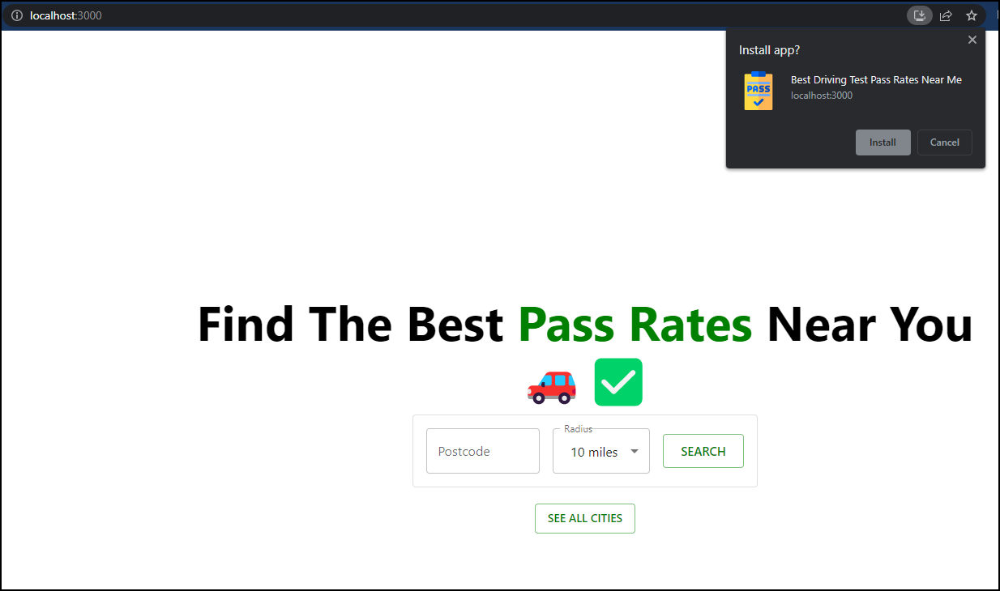

*Note:* I had to change the `display` property to `standalone` in `manifest.json` before chrome would allow me to install the app as PWA. You might need to do the same.

## Deploy the application
Next, let's deploy our application with Vercel.  
NextJS is made by Vercel, so naturally it's easy to deploy applications on their platform. It's also free for personal projects!

Go to [vercel.com](https://vercel.com/) and sign up with your GitHub account.  
Then go to the [Dashboard](https://vercel.com/dashboard), click the "Add New..." button, and then project.  
You then need to click "Import" for your project:  
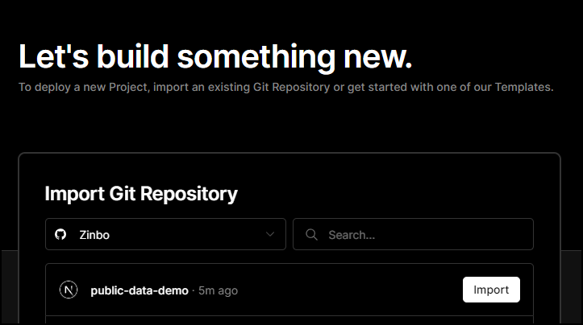
Leave all the fields on the next screen as they are and click "Deploy".

You'll then be greeted with a screen that shows the progress of the deployment:  
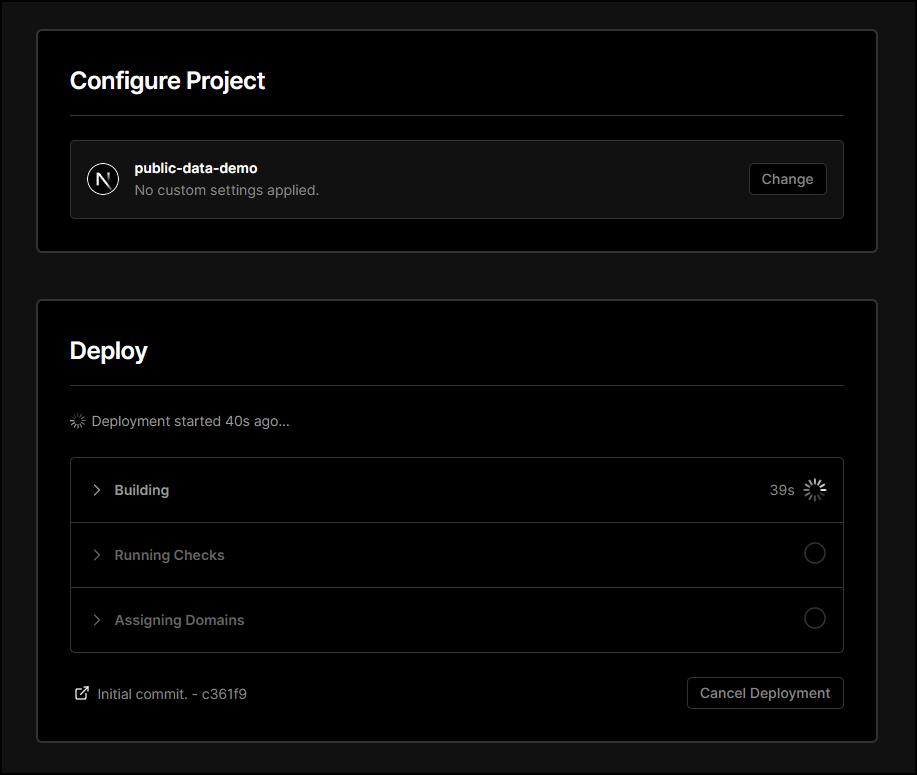

Once that is done, select your project. You should see a screen previewing the landing page of the app:  
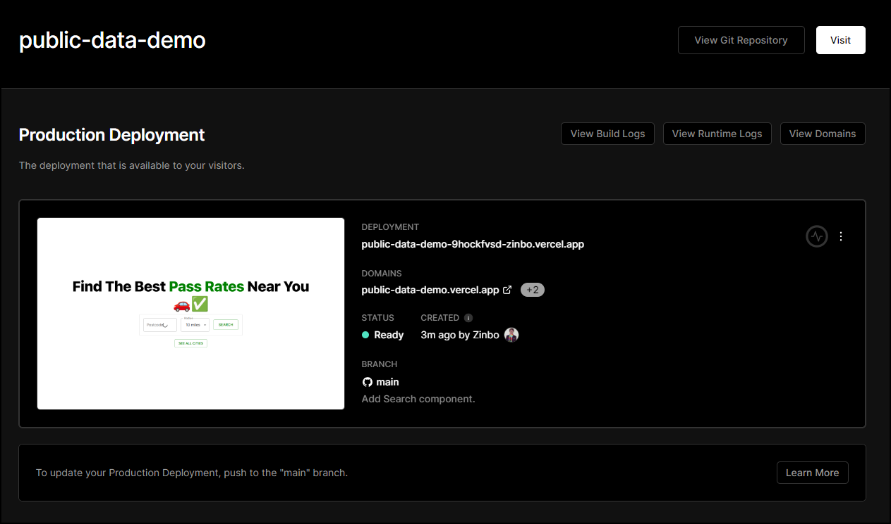

Click the "Visit" button, and you should be brought to your website!

At this point you now have a domain. For example, mine is `public-data-demo.vercel.app`. 
You can now go and change your `next-sitemap.config.js` file to point to this domain if you wish.  
If you would rather get your own domain with `vercel.app` then hang on till the next section!

### Analytics
One of the great things with Vercel is its analytics. We can enable these for free by clicking the heartbeat button, it looks like this:


Then click the Enable button to enable analytics:  
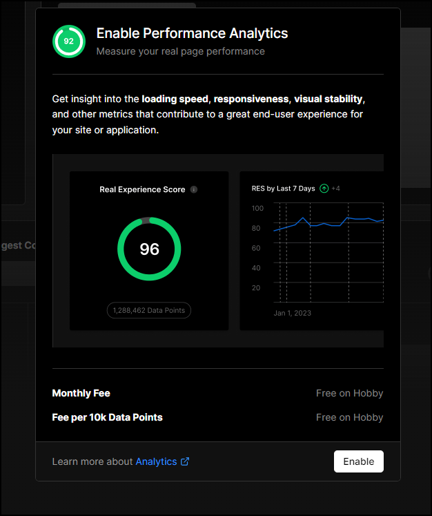
Note that you can only have analytics for free for one project at a time.  

This shows you some really useful information about your site and gives you an overall experience score, based on multiple factors:    


If you have a low score this can negatively impact SEO with Google, so it's always worth knowing how your site is performing.

### Buy a domain name
You may want to have your own domain name that isn't associated with vercel. 
Domains can vary wildly in price depending on how popular the domain is. 

I usually get my domains from [Google Domains](https://domains.google.com/) which is quick and easy to use. Say for example we 
wanted a domain related to the phrase `public-data-demo`. We can search for this in Google Domains and buy one for £10 a year:  
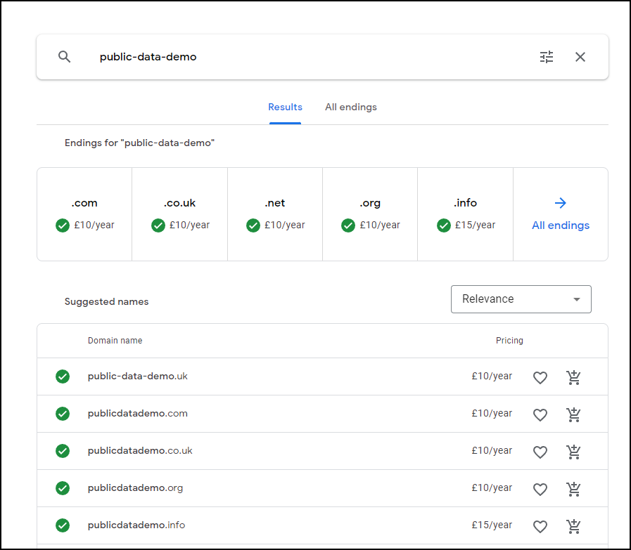

We won't be walking through how to add a custom domain here, however I can assure you that is it very easy to do with Google Domains and Vercel. 
You can find a guide on how to do this [here](https://vercel.com/docs/concepts/projects/domains/add-a-domain).

**Once your domain has been added make sure to update your robots.txt file to reflect your new domain name!** We'll get into why this is important in a later section.

### Email Forwarding
One thing that you may want to do is to be able to send emails where the email address is your own domain. Whilst creating a custom email 
address with Google Workspace costs money, a free alternative is to set up email forwarding.  

You can create an email address with your domain name, e.g. `hello@drivingpassrate.co.uk` and then forward it to your personal email address.  
To do this, go to your domain in Google Domains -> Email and scroll down to the "Email forwarding" section. Click `Add email alias` 
and enter your desired email address at your domain and your personal email address that you want emails forwarded to.  
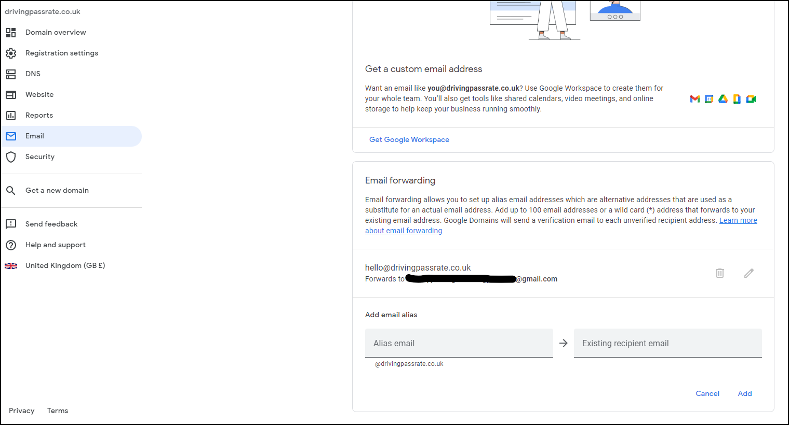

## Adding Social Media Support
We can quite easily add support to our application so that any time someone links a page to our site from social media it will show a nice card with a title, description, and an image.  
Here we'll focus on Twitter and Facebook.

### Add Twitter Support
To do this, add the following tags to `_app.tsx` in `<Head>`:  
```html
<meta name="twitter:card" content="summary" />
<meta name="twitter:url" content="https://public-data-demo.vercel.app" />
<meta name="twitter:title" content="Best Driving Test Pass Rates Near Me" />
<meta name="twitter:description" content="Give yourself the best opportunity to pass your driving test. Find the driving test centre that has the best pass rate near you. Find in locations such as Manchester, London, Birmingham, Newcastle, Leeds, Wales, Scotland, anywhere in the UK." />
<meta name="twitter:image" content="https://public-data-demo.vercel.app/icon-512x512.png" />
<meta name="twitter:creator" content="@shanepjennings" />
```
Make sure to change the URL, image, and creator tags to reflect your own!  

Using this link in a tweet will now show a card, like this:  
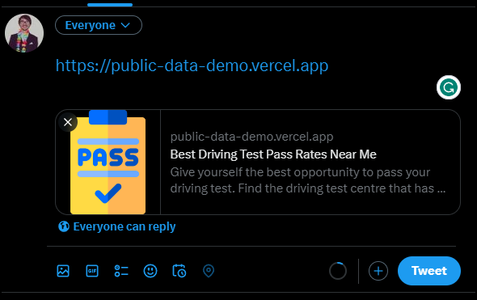

### Add Facebook Support
To do this, add the following tags to `_app.tsx` in `<Head>`:
```html
<meta property="og:type" content="website" />
<meta property="og:title" content="Best Driving Test Pass Rates Near Me" />
<meta property="og:description" content="Give yourself the best opportunity to pass your driving test. Find the driving test centre that has the best pass rate near you. Find in locations such as Manchester, London, Birmingham, Newcastle, Leeds, Wales, Scotland, anywhere in the UK." />
<meta property="og:url" content="https://public-data-demo.vercel.app" />
<meta property="og:image" content="https://public-data-demo.vercel.app/icon-512x512.png" />
```

Make sure to change the URL and image tags to reflect your own!

Using this link in a Facebook post will now show a card, like this:  
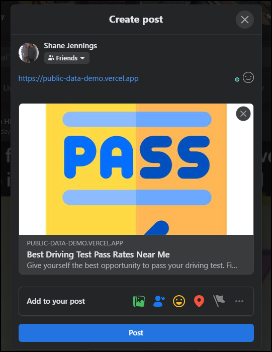

### Testing Social Media Support
If you want to test how your website will appear on various social media platforms from various devices you can use the [Open Graph Simulator](https://en.rakko.tools/tools/9/).  
Enter your website URL and you'll be shown how your website would appear on these platforms:  
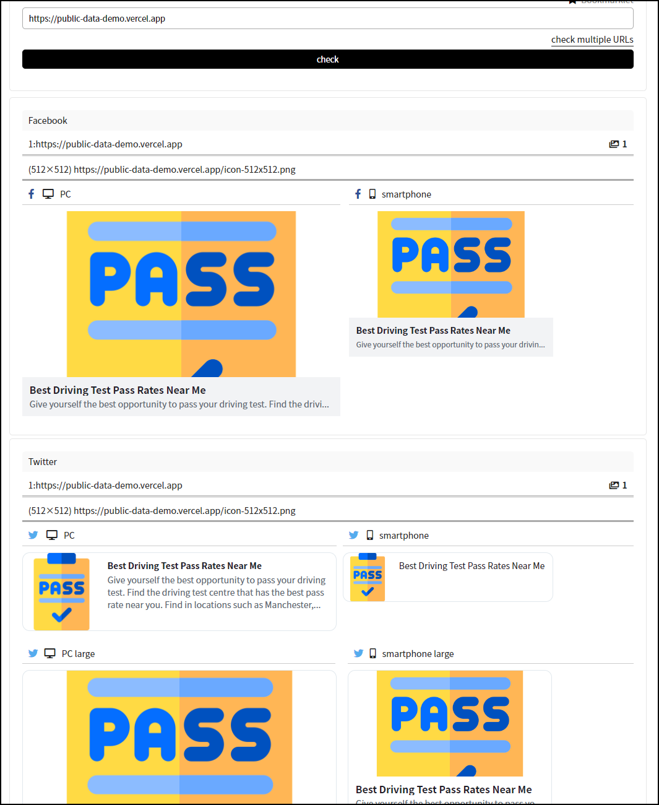

## Tracking Website Analytics
Once your website is live you might be asking yourself some of these questions: 
- How can I see if anyone is even using my website?
- How can I see if my website shows up in Google Search?

To answer these questions we'll be using 2 Google products: Google Analytics and Google Search Console.

## Add Google Analytics
Google Analytics is a great tool for assessing how your website is performing. It tracks how many users have visited your website, where in the world they are from, which pages are the most popular, and a lot more! 
Adding it is easy and free.

If you're new to Google Analytics then first go [here](https://analytics.google.com/analytics/web/provision/#/provision) and click the "Start measuring" button.
This will prompt you to create an account and a property. if you're a single developer then usually you'll have 1 account to encompass all of your websites, and have a property per website.

Once this is done you should be given the Measurement ID that you'll need to enable analytics collections for your website.    
If not, then click on the Gear icon on the bottom left of the screen, click "Data Streams" under the property column, and select the "Web" tab:  
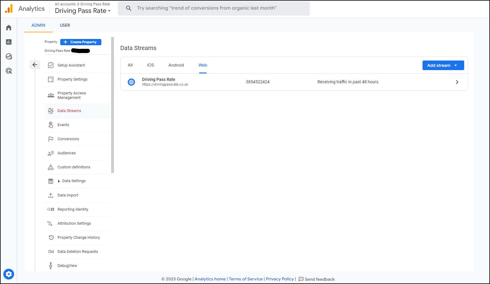

Once here, click the `>` button, which will show all the stream details. What you need is the Measurement ID:  
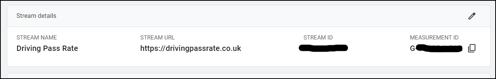

Once you have this you can add the Google Analytics script to your website.  

Go to `_app.tsx` and add the following, before the `<Head>` element:  
```tsx
<Script id="google-tag-manager" strategy="lazyOnload"
        src="https://www.googletagmanager.com/gtag/js?id=G-XXXXXX"/>
<Script id="google-analytics" strategy="lazyOnload">
  {`
                window.dataLayer = window.dataLayer || [];
                function gtag(){dataLayer.push(arguments);}
                gtag('js', new Date());

                gtag('config', 'G-107ZE4LZ3R', {
                    page_path: window.location.pathname,
                    }); 
            `}

</Script>
```

Once this has been added to your website try visiting your website a few times and click around onto various pages.  
Eventually you'll start seeing data in the Google Analytics console:  
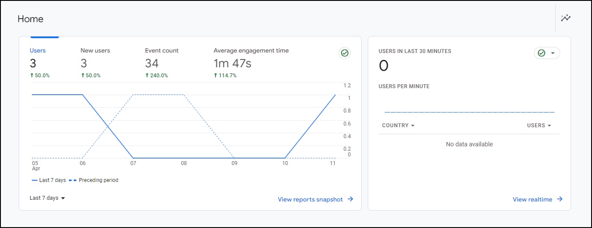

I would recommend having a play around with the different reports and analytics. It's really useful!

## SEO 
You might have heard of SEO before. It stands for Search Engine Optimisation, and it's all about making your website appear in search engine results (such as Google). 
The higher your website in the list of search results, the more chance you have of someone using your website. If you have monitised your website (which we'll discuss later) then better SEO can equal more income.

There are many tools related to SEO out there. Some of them free, some of them not. Some tools can help you with what's called keyword research, which can help you decide on the best words to use on your website such that
you're more likely to come up when people search for terms.  

In this section we'll be looking at Google Search Console, which like all other tools used in this blog is free.  
There are 2 features that I find the most useful with Google Search Console for SEO:
1. Indexing: You can see if Google has indexed pages from your website. Pages will only appear in a Google search if they have been indexed.
2. Performance: You can see how many times your website has appeared in a Google search, how many times people have clicked on a link to your website, what people searched for, and more.

### Setting up Google Search Console

To get started go [here](https://search.google.com/search-console) and enter your website's domain under the Domain box on the left, and click continue.  
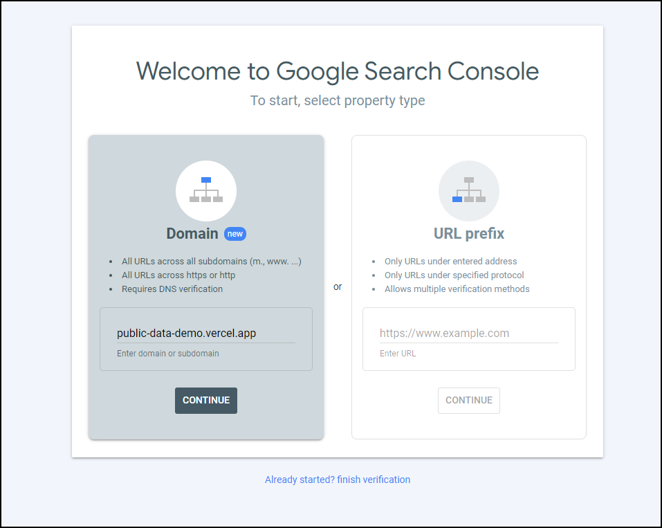

You'll be shown a screen asking you to verify domain ownership, like this:
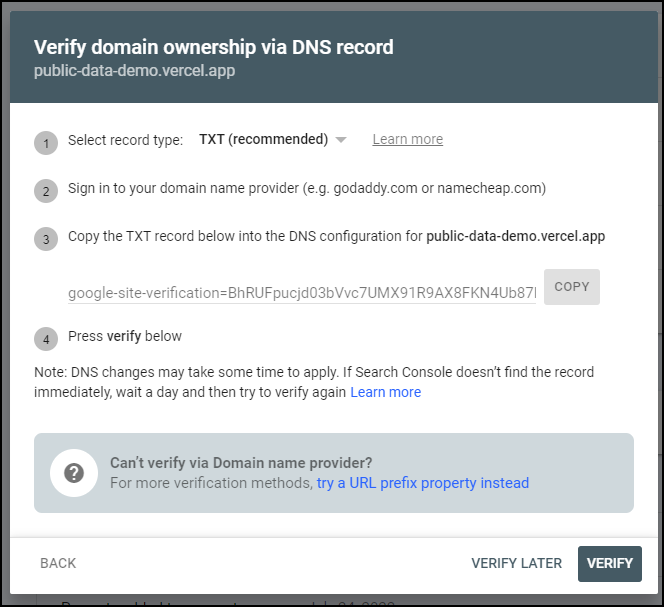

We need to do this before we can use Google Search Console.  
Unfortunately we cannot do this with the basic Vercel domain we've been given for free (if someone finds a way to do this let me know!) so this step relies 
on you having bought a domain in the previous step.  
Depending on what domain provider you used, the steps will be different.  

If you used Google Domains you can do this by:
- Opening your domain in Google Domains
- Select "DNS" from the left hand sidebar
- Click "Manage custom records"
- Click "Create new record"
  - Host name: leave blank
  - Type: A
  - TTL: Leave as default
  - Data: The text provided by Google Search console, starting with "google-site-verification="
    
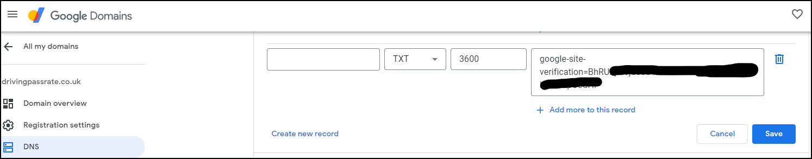

Once you have done this, click the "verify" button on Google Search Console. It may take some time to reflect the change, so you may have to come back to this later.

### Indexing
The most important aspect to check first is indexing. Now if you have only just deployed your website it is very likely that Google has not yet indexed your website.  
Google does this by using what's known as a "crawler" which finds your `robots.txt` file, which we added earlier. The `robots.txt` file tells the crawler what URLs it can access to crawl.  
Our `robots.txt` file contains a link to our `sitemap.xml` file, which points to our `sitemap-0.xml` file, which contains the locations of all of our static pages.  
The crawler will find this, and then start indexing each of these pages.  
It is important to note that this process can take **months**, especially if the website isn't appearing in a lot of Google search results. However, there are ways that you can speed up the process, which we'll discuss further down.

You can see if Google has found your sitemap.xml file by clicking on "Sitemaps" on the left-hand sidebar. If your sitemap has been found then you will see it here.   
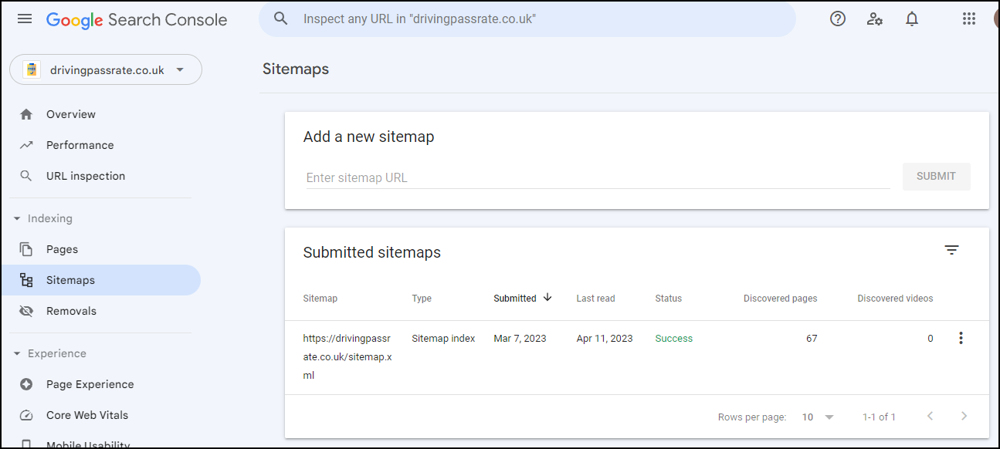

If your sitemap hasn't been found then you can speed up this process by submitting a link to your sitemap using the `Add a new sitemap` box. This will add the sitemap to crawler's queue.  

Once your sitemap has been discovered then Google will start automatically discovering pages. In the screenshot above you'll see under the "Discovered pages" heading that 67 pages have been
discovered on my website, [drivingpassrate.co.uk](https://drivingpassrate.co.uk/).

Once you have some pages appearing you can dig into this deeper by clicking on "Pages" on the left-hand sidebar. This will show you, out of all the discovered pages, which have been indexed and which have yet to be indexed.  
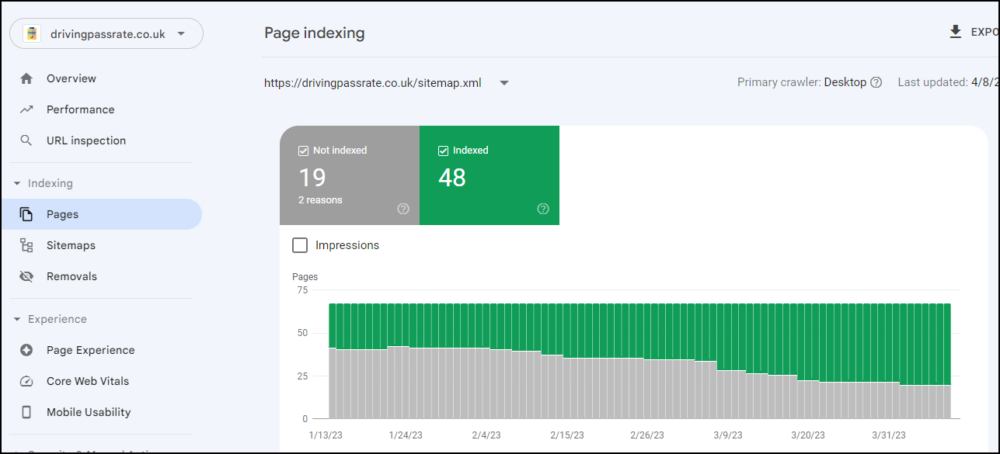

In the image above you can see how pages on my website have been indexed over time.  
At the bottom of this page we can see more details on why some pages have not been indexed.  
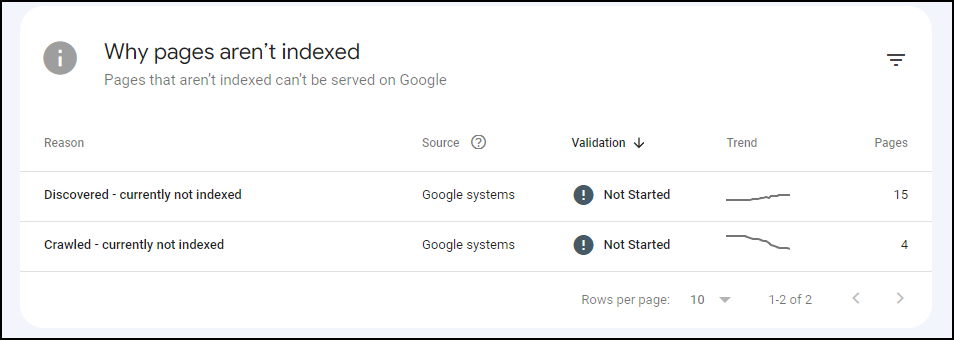

Here we can see that Google has discovered 15 pages (by using the sitemap), but has not yet crawled or indexed them, and has crawled 4 pages but has not yet indexed them.  
We can drill deeper again to see which pages haven't been indexed.  
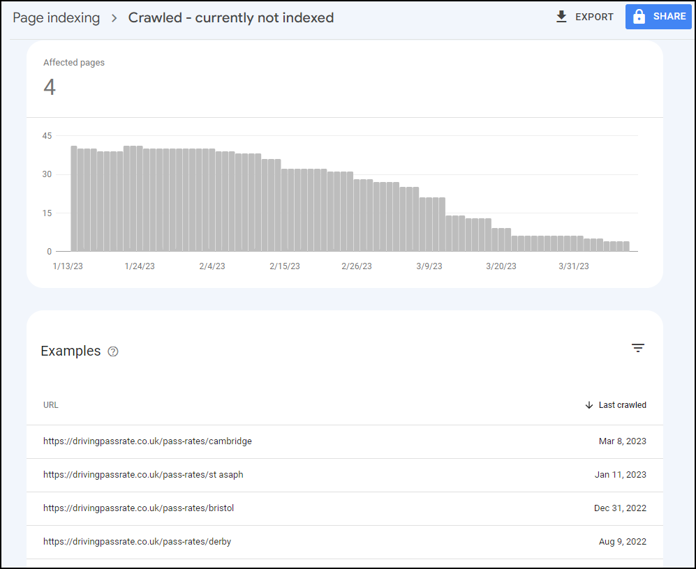

I mentioned that this process can take months, and you can see proof of that in the image above, where [drivingpassrate.co.uk/pass-rates/derby](https://drivingpassrate.co.uk/pass-rates/derby) was crawled in August last year but still hasn't been indexed.

We can speed up this process by forcing our pages into Google's indexing queue. To do this, search for your page in the search bar at the top that says "Inspect any URL". 
Note that you need to search for the **whole** URL, including the HTTPS. The search is also case-sensitive so make sure that is also correct.  
Once you've searched for a page you can check that that page exists by clicking the "Test Live URL" button. 
If you've entered the wrong URL then you'll see "Page cannot be indexed: Not found (404)", like this:  
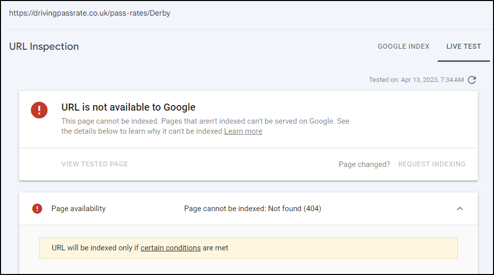  

If you've entered the correct URL then you should see "Page can be indexed", like this:  
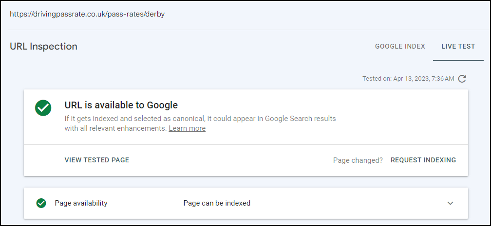  

To force the page into the indexing queue click the "Request Indexing" button.  
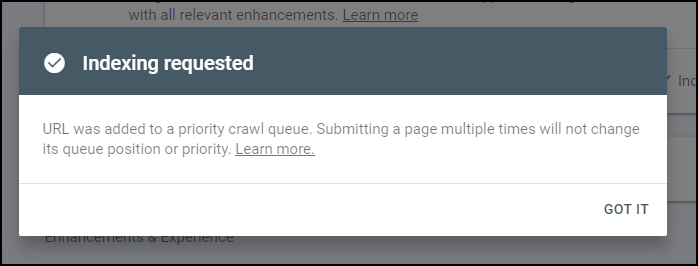  

You should then see a popup stating that the URL was added to the queue. Note that it also says that submitting the same page multiple times will not change the queue position, so don't bother spamming the "Requeset Indexing" button!  
Note that even though your page has been added to the queue it can still take a long time to be indexed! But it will be faster than waiting for the crawler to automatically crawl it.  
Please also note that you can only request a small number of pages to be indexed at one time before your quota is exceeded. This is around 10 pages per day. Once you reach this, you'll see this popup when trying to request indexing:    
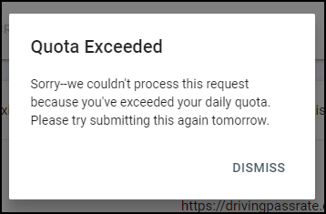  

### Performance
The next great feature of Google Search Console is analysing search performance. This shows us details such as:
- How many people have seen our results when searching in Google
- How many people have clicked on one of results when searching in Google
- What people were searching for when they saw our results in Google
And more.

To see all this, click on "Performance" on the left-hand sidebar. At the top of the page you will see a graph like this:    
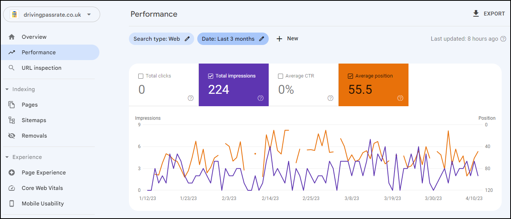  

Here we can see a number of metrics:  
- Total clicks: how many times a user clicked through to your site. 
- Total impressions: how many times a user saw a link to your site in search results. 
- Average CTR: the percentage of impressions that resulted in a click.
- Average position: the average position of your site in search results, based on its highest position whenever it appeared in a search.

At the bottom of the page we can see a table which shows us:
- the queries that people searched for
- the pages that appeared in the search results
- the countries that people were searching from
- The devices used by people to search
- The search appearance
- The dates our pages appeared in search results

Each result set show us the number of impressions and the position of our website in the search results.  
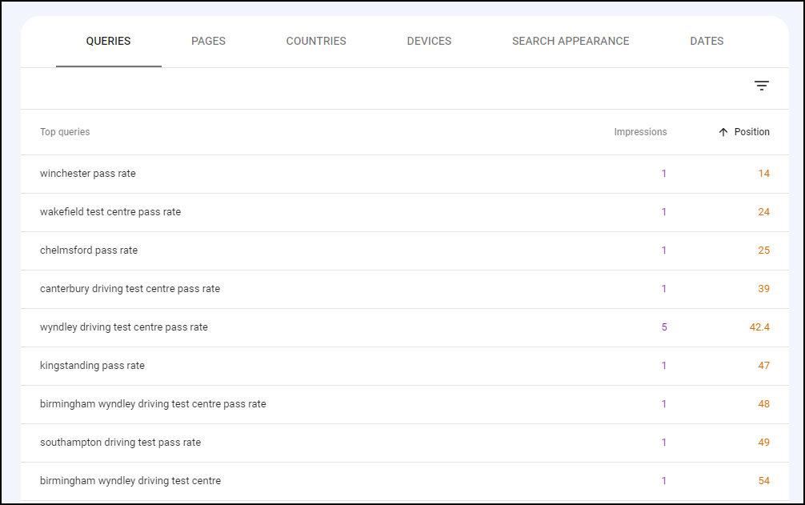  

We can drill further into any of these results. For example, by clicking the top result "winchester pass rate" we can see the page that appeared in the search results, as well as all the other metrics such as country and device.  
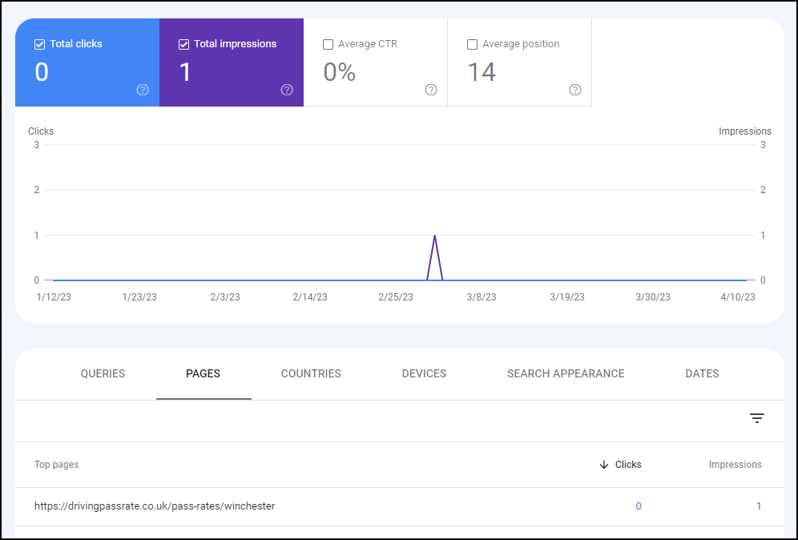  

### More features
There are more features of Google Search Console which I won't cover here, such as core web vitals (which we also saw in Vercel Analytics). I would encourage you to have a play with it yourself and see what it can do for you!

### Keyword Research
It's worth touching on the topic of keyword research as we are discussing SEO. In Google Search Console we were able to see what keywords people searched for when our website came up as a result. However, we don't know what similar keywords 
people searched for where our website did not appear in the results.
Keyword research is something you can do to find out what users are searching for before you even start your website. That way you can know which keywords you should be adding and targeting on your website to improve SEO.  

Keyword research is a broad topic and I won't be going into a lot of detail here, but it's worth mentioning that there are free tools you can use to do this keyword research. One example is [Ahrefs Ketword Generator](https://ahrefs.com/keyword-generator).

Here you can type in a number of keywords related to your website, so that you can find what people are searching for related to those keywords. For example, if I search for the terms "driving test centre pass rate", then I'll get the following results:    
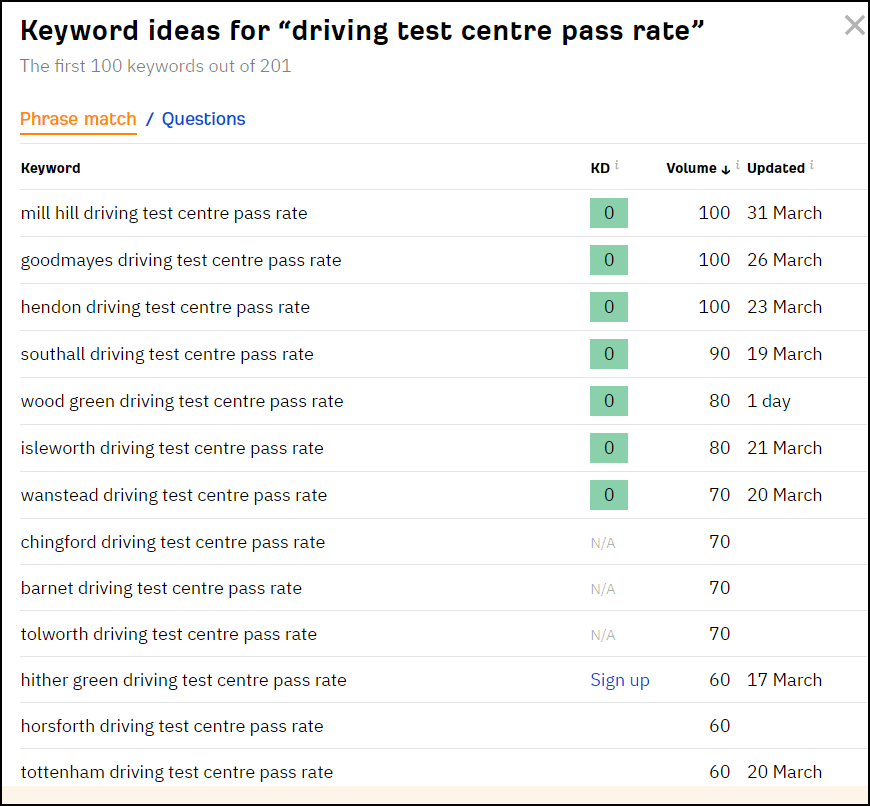  

We can see here that people are searching for "mill hill driving test centre pass rate", with around 100 searches per month. Based on this it may be worth adding a page specifically for mill hill to our website.

## Monitise your app with google ads
- Walk through adding google scripts
- Walk through adding app through google ads website

### Adding a privacy policy
- GDPR with google
- find website used to make privacy policy
- show how to add it in google adds and app

## Demo own project
- Link to website
- GitHub repo

# Conclusion
- Link to website
- GitHub repo
- Give conclusion on what they learned.
- Extensions, tests, etc.?