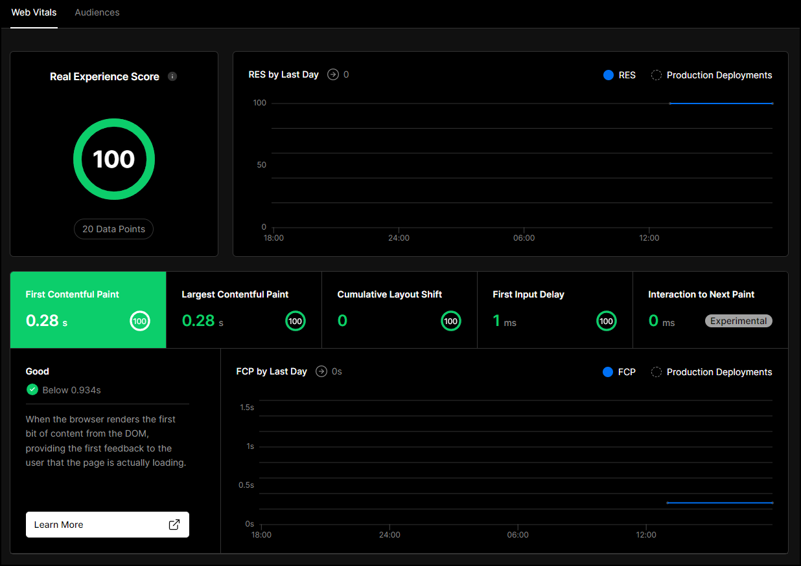

# Introduction
In this post, we'll explore how to create an engaging website using public data that you can monetize and use to impress potential employers. 
You'll learn the benefits of developing a personal project using public data and follow an example of building an app from scratch to deployment, complete with its own domain.

# Why should I create my own personal project?
Developers create personal projects for several reasons, including showcasing their skills to potential employers, learning new technologies, having fun, and making a profit. Often, a project can fulfill all these reasons simultaneously. Building a personal project is one of the best ways to create a portfolio that can help you break into the software industry and land a job.

# Why should I use public data?
If you're looking for project ideas, public data can be an excellent source of inspiration. Public data is easy to obtain, it's free, and when combined with other data, it can provide substantial value to users. Even presenting data in a user-friendly format can be a significant win, considering that public data is often not presented this way.

Some examples of sources of public data are government and video games. 
For example, you can find health data, such as the number of vaccinations in England, on the UK Government's Coronavirus Dashboard [here](https://coronavirus.data.gov.uk/details/vaccinations?areaType=nation&areaName=England). 
Another example is tax data, such as council tax data, which can be found [here](https://www.gov.uk/government/statistical-data-sets/live-tables-on-council-tax).
Alternatively, you can find video game data, such as the World of Warcraft API or the PokéAPI for Pokémon. 

You could also scrape data from websites if they don't offer a nice way to get their data, depending on their data usage policies, however that deserves its own separate post.
If you're interested in web scraping, you can find a tutorial [here](https://www.freecodecamp.org/news/web-scraping-python-tutorial-how-to-scrape-data-from-a-website/) from FreeCodeCamp.

There are many other sources of public data, and the key is to choose data that interests you or solves a particular problem you're facing. That way you're much more likely to stick with the project!

# Creating a Website That Shows the Driving Test Centres with the Best Pass Rates Near You
In this section, we'll walk through a step-by-step guide on how to build a website that allows users to search for driving test centers near them and show which centers have the best pass rates. 
We'll be using the UK Government's public data on driving test center pass rates. 
I built this app because I'm learning to drive, and I wanted to know which test center would give me the best chance of passing.

## The Requirements
Before we begin, let's set out the requirements:
- The user can see the best driving test centres around them, based on their postcode.
- The user can see the best driving test centres around popular cities.
- The user can see the Google Reviews rating for each test centre.
- The user can easily see where the test centre is located on Google Maps.

## Setting up the app
For this application, we'll use Next.js as the framework and Material UI for the design. If you haven't used Next.js before, don't worry. Most of it will be clear if you've used React before.

I chose Next.js for its static site generation, which makes it lightning-fast. Since most of the data we use here is not dynamic, we can generate our pages at build time. 
This not only makes the application load extremely fast, but it's also good for SEO (Search Engine Optimization), which is crucial if we want to monetize our app later. 
Next.js has an excellent introduction to SEO, which you can find [here](https://nextjs.org/learn/seo/introduction-to-seo). It's also easy to host, as we'll see later.
For this application we'll be using Next.JS as the framework and Material UI for the design.  
If you haven't used Next.JS before don't worry. If you've ever used React before then the majority of it will be clear.

Throughout this post, we'll explore how we can use Next.js for static site generation. However, you can read more about Next.js [here](https://nextjs.org/docs/getting-started).

To start, lets initialise our project:
```bash
> npx create-next-app@latest --ts
```
Once completed, we can start up our application by running:
```bash
npm run dev
```

Opening localhost:3000 should then show us the Next.js example page:  


Your directory structure should look like this:


## Getting the Data

### Acquiring Test Centre Data
Please note that in this section I'll be deliberately brief on the details.
This is partly because the point of this post isn't to copy what I did entirely, but rather to provide inspiration,
but also because I don't want this post to be any longer than it needs to be. I leave the massaging of data as an exercise for the reader.

To build our web app, we first need to obtain data on the driving test centres. 
This data can be downloaded from the UK government's page on driving test pass rates, which can be found [here](https://www.gov.uk/government/statistical-data-sets/car-driving-test-data-by-test-centre). 
Specifically, we need the "Car pass rates by gender, month and test centre" document which provides the total pass rate for men and women for each driving test centre per year.

This document contains a tab for each year, with a record of the total pass rate for all men and women that year for each driving test centre.


As an example, we can see that Aberdeen North had a total pass rate of 48.2% for the year 2022-23.  
Once you have this data, you can use your preferred scripting language to extract a list of each test centre name with its corresponding total pass rate.  

### Retrieving Test Centre Location Data
In order to calculate the distance between the user and each test centre, we need to determine the location of each test centre. 
One way to accomplish this is by using the Google Maps Places API. While the API is not free, it offers 28,500 free map-loads per month, which should be more than sufficient for our needs.

To use the Places API, you need to obtain your own API key, which you can do by following the instructions provided [here](https://developers.google.com/maps/documentation/javascript/get-api-key).

We'll be using two endpoints of the Places API - `findplacefromtext` and `details`. These endpoints return the following fields:
- `geometry`: The longitude and latitude of the test centre location.
- `rating`: The Google reviews rating for the location.
- `user_ratings_total`: The total number of reviews left for the location.
- `url`: The link to the location in Google Maps.

We can use the `findplacefromtext` endpoint to search for our test centres by name and retrieve a list of candidates with their corresponding name and place ID. 
For example, when searching for the Mill Hill (London) driving test centre, you can query the following URL:
https://maps.googleapis.com/maps/api/place/findplacefromtext/json?input=Mill%20Hill%20(London)%20Driving%20Test%20Centre&inputtype=textquery&key=<YOUR API KEY>&locationbias=ipbias&fields=name,place_id

This query returns:
```json
{
  "candidates": [
    {
      "name": "Mill Hill Driving Test Centre",
      "place_id": "ChIJXdhrutoWdkgRh_OPEmlGwmc"
    }
  ],
  "status": "OK"
}
```

Next, we can use the place ID to retrieve all the details about that test centre using the `details` endpoint. For example, you can query the following URL to retrieve details for the Mill Hill (London) driving test centre:  
https://maps.googleapis.com/maps/api/place/details/json?place_id=ChIJXdhrutoWdkgRh_OPEmlGwmc&key=<YOUR API KEY>&fields=geometry,rating,url,user_ratings_total

This query returns:
```json
{
  "html_attributions": [],
  "result": {
    "geometry": {
      "location": {
        "lat": 51.6103168,
        "lng": -0.2469914999999999
      },
      "viewport": {
        "northeast": {
          "lat": 51.6115767802915,
          "lng": -0.2457076697084979
        },
        "southwest": {
          "lat": 51.6088788197085,
          "lng": -0.248405630291502
        }
      }
    },
    "rating": 4.7,
    "url": "https://maps.google.com/?cid=7476615748485378951",
    "user_ratings_total": 350
  },
  "status": "OK"
}
```

For test centres where I got more than one candidate I hand-picked the right one - however you could write your own algorithm to programmatically figure this out.

### Combining the data
we need to combine the data we collected earlier to create a list of all the test centres. We'll include their name, pass rate, lat long, rating, number of ratings, and the Google Maps URL in a JSON file. 
Let's save this file in a directory called `testcentres` in the root directory.  
Here's an example of what the JSON file should look like:
```json
[
  {
    "name": "Aberdeen North",
    "passRate": "57.3",
    "mapDetails": {
      "lat": 57.1856443,
      "lng": -2.0964023,
      "rating": 4.1,
      "url": "https://maps.google.com/?cid=5779616227159057902",
      "userRatingsTotal": 7
    }
  },
  {
    "name": "Aberdeen South (Cove)",
    "passRate": "64.5",
    "mapDetails": {
      "lat": 57.0884979,
      "lng": -2.1077442,
      "rating": 4.3,
      "url": "https://maps.google.com/?cid=10499189161470180622",
      "userRatingsTotal": 19
    }
  },
  ...
]
```

nce you've saved this file, your directory structure should look like this:  


## Setting up the landing page
Before we get started on our landing page, lets install Material UI and emotion:
```bash
> npm install @mui/material
> npm install @mui/icons-material
> npm install @emotion/react
> npm install @emotion/styled
```

Next, we'll update our `_app.tsx` file and `index.tsx` file to use Material UI components and styles. 
We'll also change the title of our landing page to "Best Driving Test Pass Rates Near Me.".  
Here's what the updated files should look like:
```tsx
import '../styles/globals.css'
import type {AppProps} from 'next/app'
import {Container, createTheme, ThemeProvider} from "@mui/material";
import Head from "next/head";
import Box from "@mui/material/Box";

const theme = createTheme({
    typography: {
        fontFamily: [
            "-apple-system", "BlinkMacSystemFont", "Segoe UI", "Roboto", "Oxygen", "Ubuntu", "Cantarell", "Fira Sans", "Droid Sans", "Helvetica Neue", "sans-serif"
        ].join(",")
    },
    palette: {
        primary: {
            light: '#6985ff',
            main: '#008000',
            dark: '#0031c3',
            contrastText: '#ffffff',
        },
        secondary: {
            light: '#9fcfff',
            main: '#689eff',
            dark: '#2770cb',
            contrastText: '#ffffff',
        },
    },
});

function MyApp({Component, pageProps}: AppProps) {
    return <>
        <Head>
            <title>Best Driving Test Pass Rates Near Me</title>
        </Head>
        <ThemeProvider theme={theme}>
            <Box sx={{display: 'flex', flexDirection: 'column', minHeight: '100vh'}}>
                <Container fixed sx={{display: 'flex', flex: 1, flexDirection: 'column'}}>
                    <Component {...pageProps} />
                </Container>
            </Box>
        </ThemeProvider>
    </>
}

export default MyApp
```

```tsx
import type {NextPage} from 'next'
import styles from '../styles/Home.module.css'
import {Typography} from "@mui/material";

const Home: NextPage = () => {

  return (
          <div className={styles.content}>
            <div style={{display: 'flex'}}>
              <Typography variant="h2" sx={{m: 1, fontWeight: 'bold'}}>Find The Best <span
                      style={{color: 'green'}}>Pass Rates</span> Near You <br/>🚗✅</Typography>
            </div>
          </div>
  )
}

export default Home
```

The `Home.modules.css` file will contain specific styles for our landing page. Replace it with the following:
```css
.container {
  padding: 0 2rem;
}

.app {
  display: flex;
  flex: 1;
  text-align: center;
}

.content {
  text-align: center;
  display: flex;
  flex: 1;
  flex-direction: column;
  align-items: center;
  justify-content: center;
  font-size: calc(10px + 2vmin);
}

.main {
  min-height: 100vh;
  padding: 4rem 0;
  flex: 1;
  display: flex;
  flex-direction: column;
  justify-content: center;
  align-items: center;
}
```

The `globals.css` file will contain global styles that will be applied to all pages. Replace it with the following:
```css
html,
body {
  padding: 0;
  margin: 0;
  font-family: -apple-system, BlinkMacSystemFont, Segoe UI, Roboto, Oxygen,
  Ubuntu, Cantarell, Fira Sans, Droid Sans, Helvetica Neue, sans-serif;
}

* {
  box-sizing: border-box;
}
```

You can also delete the `api` and `hello.ts` file inside of it.

Running `npm run dev` should a page that looks like this:


## Creating the Results Page for a Postcode
One of our main requirements was to enable users to view the best driving test centres in their area, based on their postcode. 
To achieve this, we need to find the nearest test centres based on a given postcode and display the results on a dedicated web page.

To do this, we can use [postcodes.io](https://postcodes.io/), an open-source postcode and geolocation API for the UK, to find the nearest test centres based on a postcode. 
Postcodes.io API provides us with approximate longitude and latitude data based on a postcode, and vice versa. It even offers autocomplete data for partial postcodes, which we'll use later.

To start, we'll define a file that connects to the postcodes.io API. We'll create a new directory called `api` and a new file called `PostcodesAPI.ts` inside it. 
This file contains the following code:
```ts
import LongLat from "./LongLat";

const baseUrl = 'https://api.postcodes.io/postcodes/';

export async function getLongLatFromPostcode(postcode: string) {
  const response = await getPostcodeResponse(postcode);
  if (!response) return;
  return response.result;
}

const getPostcodeResponse = async (postcode: string): Promise<PostcodeResponseDTO | null> => {
  return await fetch(`${baseUrl}${postcode}`, {
    headers: {
      'Content-Type': 'application/json',
      'Accept': 'application/json'
    }
  }).then(response => {
    return response.json();
  }).catch(error => {
    console.error(error);
    return null;
  })
}

interface PostcodeResponseDTO {
    result: LongLat
}
```

Next, we'll create a new directory called `lib` and add a file called `LongLat.ts`. This file contains the following code:
```ts
export default interface LongLat {
    longitude: number
    latitude: number
}
```

We need to create a function that processes our `testcentres.json` file that we generated earlier and converts it into a list of objects. 
To achieve this, we'll use the `getStaticProps` function provided by Next.js. You can read more about this [here](https://nextjs.org/learn/basics/data-fetching/with-data).

Create a new file inside the `lib` directory called `testcentres.ts` containing the following:
```ts
import path from "path";
import fs from "fs";
import {TestCentre} from "./TestCentre";

const directory = path.join(process.cwd(), 'testcentres');

export function getTestCentres() {
    const fullPath = path.join(directory, `testcentres.json`);
    const testCentres : TestCentre[] = JSON.parse(fs.readFileSync(fullPath, 'utf8'));
    return testCentres;
}
```

We also need to create another file called `TestCentre.ts`, which contains the following:
```ts
interface MapDetails {
    lat: number
    lng: number
    rating: number
    url: string
    userRatingsTotal: number
}

export interface TestCentre {
    name: string
    passRate: string
    mapDetails: MapDetails
}

export interface TestCentreWithDistance extends TestCentre {
    distance: number
}
```

Now, we can create a new page called `pass-rates.tsx` in the `pages` directory. This will get the test centres within the radius and display these. To calculate the distance we can use the [Haversine formula](https://en.wikipedia.org/wiki/Haversine_formula), and then convert that to miles. 
The `pass-rates.tsx` file should contain the following code:
```tsx
import React, {useEffect} from "react";
import {useRouter} from 'next/router'
import Head from "next/head";
import {Typography} from "@mui/material";

import {getLongLatFromPostcode} from "../api/PostcodesAPI";
import LongLat from "../lib/LongLat";
import {getTestCentres} from "../lib/testcentres";
import {TestCentre, TestCentreWithDistance} from "../lib/TestCentre";

export async function getStaticProps() {
    const testCentres = getTestCentres();
    return {
        props: {
            testCentres
        },
    };
}

function getTestCentresWithinRadius(usersLongLat: LongLat, radius: number, testCentres: TestCentre[]) : TestCentreWithDistance[] {
    return testCentres.flatMap(centre => {
        const distance = getDistanceFromLatLon(usersLongLat.latitude, usersLongLat.longitude, centre.mapDetails.lat, centre.mapDetails.lng);
        if(distance > radius) return [];
        const centreWithDistance = structuredClone(centre) as TestCentreWithDistance;
        centreWithDistance.distance = distance;
        return centreWithDistance;
    })
}

function getDistanceFromLatLon(lat1: number, lon1: number, lat2: number, lon2: number): number {
    const R = 6371; // Radius of the earth in km
    const dLat = deg2rad(lat2 - lat1);  // deg2rad below
    const dLon = deg2rad(lon2 - lon1);
    const a =
        Math.sin(dLat / 2) * Math.sin(dLat / 2) +
        Math.cos(deg2rad(lat1)) * Math.cos(deg2rad(lat2)) *
        Math.sin(dLon / 2) * Math.sin(dLon / 2);
    const c = 2 * Math.atan2(Math.sqrt(a), Math.sqrt(1 - a));
    return (R * c) * 0.62137119; // Convert distance from km to miles
}

function deg2rad(deg: number): number {
    return deg * (Math.PI / 180);
}

export default function Results({testCentres}:any) {
    const router = useRouter()
    const {postcode, radius} = router.query;
    const [results, setResults] = React.useState<TestCentreWithDistance[]>([]);

    const getResults = async () => {
        if (!postcode) return;
        if (!radius) return;
        const usersLongLat = await getLongLatFromPostcode(postcode as string);
        if (!usersLongLat) return;

        setResults(getTestCentresWithinRadius(usersLongLat, parseInt(radius as string), testCentres));
    }

    useEffect(() => {
        getResults();
    }, [postcode, radius])


    return (
        <>
            <Head>
                <meta charSet="utf-8"/>
                <title>Best Driving Test Pass Rates Near Me - Pass Rates</title>
                <meta name="description" content={`Shows the latest pass rates for driving test centres near ${postcode} within a ${radius} mile radius`}/>
            </Head>

            <Typography variant="h6">Test Centres within {radius} mile radius of {postcode}</Typography>
            <ul>

            {
                results.map(
                    r => <li key={r.name}>Name: {r.name}, Distance: {r.distance}, Rating: {r.mapDetails.rating}⭐ ({r.mapDetails.userRatingsTotal} reviews), mapUrl: {r.mapDetails.url}</li>
                )
            }
            </ul>

        </>
    );
}
```

We can now navigate to the /pass-rates page and pass in a postcode and a radius. E.g. to find all test centres within a 10 mile radius of Nottingham we can navigate to:
http://localhost:3000/pass-rates?postcode=NG16JX&radius=10

Which will show us the following page:


Try it out with your own postcode and different radius's!

### Showing the results as a table
While our pass rates page does show the correct results, it's not very pretty. Let's add a table instead to render the data.

To do this, let's add a new field `ResultsTable.tsx` to our `components` directory, which should contain the following:
```tsx
import * as React from 'react';
import Box from '@mui/material/Box';
import Table from '@mui/material/Table';
import TableBody from '@mui/material/TableBody';
import TableCell from '@mui/material/TableCell';
import TableContainer from '@mui/material/TableContainer';
import TableHead from '@mui/material/TableHead';
import TableRow from '@mui/material/TableRow';
import TableSortLabel from '@mui/material/TableSortLabel';
import Paper from '@mui/material/Paper';
import {visuallyHidden} from '@mui/utils';
import {TestCentreWithDistance} from "../lib/TestCentre";
import {Tooltip} from "@mui/material";
import HelpIcon from '@mui/icons-material/HelpOutline';
import MapIcon from '@mui/icons-material/Map';

interface Data {
    name: string
    passRate: number
    rating: string
    distance: number
    mapURL: string
}

function descendingComparator<T>(a: T, b: T, orderBy: keyof T) {
    if (b[orderBy] < a[orderBy]) {
        return -1;
    }
    if (b[orderBy] > a[orderBy]) {
        return 1;
    }
    return 0;
}

type Order = 'asc' | 'desc';

function getComparator<Key extends keyof any>(
    order: Order,
    orderBy: Key,
): (
    a: { [key in Key]: number | string },
    b: { [key in Key]: number | string },
) => number {
    return order === 'desc'
        ? (a, b) => descendingComparator(a, b, orderBy)
        : (a, b) => -descendingComparator(a, b, orderBy);
}

// This method is created for cross-browser compatibility, if you don't
// need to support IE11, you can use Array.prototype.sort() directly
function stableSort<T>(array: readonly T[], comparator: (a: T, b: T) => number) {
    const stabilizedThis = array.map((el, index) => [el, index] as [T, number]);
    stabilizedThis.sort((a, b) => {
        const order = comparator(a[0], b[0]);
        if (order !== 0) {
            return order;
        }
        return a[1] - b[1];
    });
    return stabilizedThis.map((el) => el[0]);
}

interface HeadCell {
    disablePadding: boolean;
    id: keyof Data;
    label: string;
    numeric: boolean;
}

const headCells: readonly HeadCell[] = [
    {
        id: 'name',
        numeric: false,
        disablePadding: true,
        label: 'Test Centre',
    },
    {
        id: 'passRate',
        numeric: true,
        disablePadding: true,
        label: 'Pass Rate',
    },
    {
        id: 'rating',
        numeric: true,
        disablePadding: true,
        label: 'Rating'
    },
    {
        id: 'distance',
        numeric: true,
        disablePadding: true,
        label: 'Distance (miles)',
    }
];

interface EnhancedTableProps {
    onRequestSort: (event: React.MouseEvent<unknown>, property: keyof Data) => void;
    order: Order;
    orderBy: string;
    rowCount: number;
}

function EnhancedTableHead(props: EnhancedTableProps) {
    const {order, orderBy, onRequestSort} =
        props;
    const createSortHandler =
        (property: keyof Data) => (event: React.MouseEvent<unknown>) => {
            onRequestSort(event, property);
        };

    return (
        <TableHead>
            <TableRow>
                {headCells.map((headCell) =>
                    (<TableCell
                            key={headCell.id}
                            align={headCell.numeric ? 'right' : 'left'}
                            sortDirection={orderBy === headCell.id ? order : false}
                        >
                            <TableSortLabel
                                active={orderBy === headCell.id}
                                direction={orderBy === headCell.id ? order : 'asc'}
                                onClick={createSortHandler(headCell.id)}
                            >
                                {headCell.label !== 'Rating' ?
                                    headCell.label : <>{'Rating'} <Tooltip
                                        title="Ratings from Google"><HelpIcon sx={{ml: 1}}/></Tooltip></>}
                                {orderBy === headCell.id ? (
                                    <Box component="span" sx={visuallyHidden}>
                                        {order === 'desc' ? 'sorted descending' : 'sorted ascending'}
                                    </Box>
                                ) : null}
                            </TableSortLabel>
                        </TableCell>
                    ))}
            </TableRow>
        </TableHead>
    );
}

interface ResultsTableProps {
    results: TestCentreWithDistance[]
}

export default function ResultsTable({results}: ResultsTableProps) {
    const [order, setOrder] = React.useState<Order>('desc');
    const [orderBy, setOrderBy] = React.useState<keyof Data>('passRate');

    const r = results.map(result => {
        return {
            name: result.name, passRate: result.passRate,
            rating: result.mapDetails.rating ? `${result.mapDetails.rating}⭐ (${result.mapDetails.userRatingsTotal} reviews)` : ``,
            mapURL: result.mapDetails.url,
            distance: result.distance
        };
    })

    const handleRequestSort = (
        event: React.MouseEvent<unknown>,
        property: keyof Data,
    ) => {
        const isAsc = orderBy === property && order === 'asc';
        setOrder(isAsc ? 'desc' : 'asc');
        setOrderBy(property);
    };

    return (
        <>
            <TableContainer component={Paper}>
                <Table
                    size={"medium"}
                    aria-labelledby="tableTitle"
                    style={{ tableLayout: 'auto' }}
                    padding={'normal'}

                >
                    <EnhancedTableHead
                        order={order}
                        orderBy={orderBy}
                        onRequestSort={handleRequestSort}
                        rowCount={results.length}
                    />
                    <TableBody>
                        {/* if you don't need to support IE11, you can replace the `stableSort` call with:
              rows.slice().sort(getComparator(order, orderBy)) */}
                        {stableSort(r, getComparator(order, orderBy))
                            .map((row) => {
                                return (
                                    <TableRow
                                        hover
                                        tabIndex={-1}
                                        key={row.name}
                                    >
                                        <TableCell>{row.name}<MapIcon onClick={() => window.open(row.mapURL)}/></TableCell>
                                        <TableCell align="right">{row.passRate}%</TableCell>
                                        <TableCell align="right">{row.rating}</TableCell>
                                        <TableCell
                                            align="right">{Math.round((row.distance + Number.EPSILON) * 100) / 100}</TableCell>
                                    </TableRow>
                                );
                            })}
                    </TableBody>
                </Table>
            </TableContainer>
        </>
    );
}
```
There's a lot of code in this file, however you should note that a lot of it is copied from the "Sorting & Selecting" example given for tables in Material UI [here](https://mui.com/material-ui/react-table/#sorting-amp-selecting).  
The most important section to focus on is the tsx returned from the function, showing how our table is rendered and with what cells and rows.  
The table contains functionality for the user to sort by each column, and each column contains a map icon, linking the user to the test centre on Google Maps.

Navigating to http://localhost:3000/pass-rates?postcode=NG16JX&radius=10 now shows us a table:  


## Adding search functionality to the landing page
The next requirement to focus on is to allow users to search for their nearest test centres from the landing page.  
To do this, we'll add a text field for the postcode, and a dropdown for the radius.

We'll start by adding a new component under our `component` directory called `Search.tsx`. This will contain the search elements we just described, with a submit button that will navigate the user to our pass rates page.
`Search.tsx` should contain the following:
```tsx
import {Box} from "@mui/system";
import {Button} from "@mui/material";
import Paper from "@mui/material/Paper";
import React, {useEffect, useState} from "react";
import {useRouter} from "next/router";


export default function Search({initialPostcode, initialRadius}:any) {
    const router = useRouter()
    const [postcode, setPostcode] = useState<string | null>(null);
    const [radius, setRadius] = useState<number>(10);

    useEffect(() => {
        setPostcode(initialPostcode);
        setRadius(initialRadius)
    }, [initialPostcode, initialRadius])

    function handleSubmit() {
        router.push(`/pass-rates?postcode=${postcode}&radius=${radius}`);
    }

    return (
        <Paper variant="outlined" sx={{p: 1}}>
            <div style={{display: 'flex', flexFlow: 'row wrap'}}>
                <Box sx={{m: 1, flex: 1}}>
                    <TextField label="Postcode" value={postcode} onChange={e => setPostcode(e.target.value)}/>
                </Box>
                <FormControl sx={{m: 1, minWidth: 120, flex: 1}}>
                    <InputLabel id="demo-simple-select-label">Radius</InputLabel>
                    <Select
                        labelId="demo-simple-select-label"
                        id="demo-simple-select"
                        value={radius}
                        label="Age"
                        onChange={e => setRadius(e.target.value as number)}
                    >
                        <MenuItem value={5}>5 miles</MenuItem>
                        <MenuItem value={10}>10 miles</MenuItem>
                        <MenuItem value={20}>20 miles</MenuItem>
                        <MenuItem value={30}>30 miles</MenuItem>
                    </Select>
                </FormControl>

                <Box sx={{m: 1, mt: 1.8, flex: 1, display: 'flex', flexDirection: 'column'}}>
                    <Button sx={{alignSelf: 'center'}} variant="outlined" onClick={handleSubmit}  size="large">Search</Button>
                </Box>

            </div>


        </Paper>
    );
}
```
Here we can see that we have a `TextField` for the postcode and a dropdown for the radius. Navigating to http://localhost:3000 shows us these new search fields:  


Try entering a postcode and clicking search, it will bring you to the pass rates page.

### Adding autocomplete to our postcode search
Currently, we have no validation for postcodes in our search component. One way that we can validate postcodes is to use [postcodes.io](https://postcodes.io/) again.  
We can call postcodes.io to check if the entered postcode is a real postcode. Even better, postcodes.io offers an autocomplete endpoint which we can use to show an autocomplete dropdown.  

We'll add the following to the `PostcodesAPI.ts` file:
```ts
export async function getPostcodeSuggestions(partial: string) {
  return (await getPostcodeAutocompleteResponse(partial))?.result;
}

const getPostcodeAutocompleteResponse = async (partial: string) : Promise<PostcodeAutocompleteResponseDTO | null> => {
  return await fetch(`${baseUrl}${partial}/autocomplete`, {
    headers: {
      'Content-Type': 'application/json',
      'Accept': 'application/json'
    }
  }).then(response => {
    return response.json();
  }).catch(error => {
    console.error(error);
    return null;
  })
}

export const isValidPostcode = async (postcode: string) : Promise<boolean> => {
  return await fetch(`${baseUrl}${postcode}`, {
    headers: {
      'Content-Type': 'application/json',
      'Accept': 'application/json'
    }
  }).then(response => {
    return response.ok;
  }).catch(error => {
    console.error(error);
    return false;
  })
}

interface PostcodeAutocompleteResponseDTO {
  result: string[]
}
```
We have added:
1. `getPostcodeSuggestions()`, which calls Postcodes.io's autocomplete endpoint to get the autocomplete suggestions.
2. `isValidPostcode()`, which checks that the passed in postcode is a valid postcode

Install:
```shell
npm install lodash
npm install @types/lodash
```

We then need to create a new component, `PostcodeAutocomplete.tsx` in the `components` directory which will replace the postcode `TextField` element in the `Search` component with an `Autocomplete` element. Firstly, we'll need to install lodash.  
Run the following:
```shell
npm install lodash
npm install @types/lodash
```

Then, add the following to `PostcodeAutocomplete.tsx`:
```tsx
import * as React from 'react';
import {useCallback, useEffect} from 'react';
import Box from '@mui/material/Box';
import TextField from '@mui/material/TextField';
import Autocomplete, {AutocompleteRenderInputParams} from '@mui/material/Autocomplete';
import LocationOnIcon from '@mui/icons-material/LocationOn';
import Grid from '@mui/material/Grid';
import debounce from 'lodash/debounce';
import {getPostcodeSuggestions} from "./PostcodesAPI";
import {CircularProgress} from "@mui/material";

export const getOptionsAsync = (query: string): Promise<string[]> => {
    if(!query) return Promise.resolve([]);
    return getPostcodeSuggestions(query).then(suggestions => suggestions ? suggestions : []);
};

interface PostcodeAutocompleteProps {
    setPostcode: (s: string | null) => void
    postcodeError: boolean
    setPostcodeError: (b: boolean) => void
    submitForm: () => void
    postcode: string | null
}

export default function PostcodeAutocomplete({
                                                 setPostcode,
                                                 postcodeError,
                                                 setPostcodeError,
                                                 submitForm,
                                                 postcode
                                             }: PostcodeAutocompleteProps,) {
    const [options, setOptions] = React.useState<string[]>([]);
    const [value, setValue] = React.useState<string | null>(postcode);
    const [searchQuery, setSearchQuery] = React.useState<string>("");
    const [isLoading, setIsLoading] = React.useState<boolean>(false);

    const getOptionsDelayed = useCallback(
        debounce((query: string, callback: (options: string[]) => void) => {
            setOptions([]);
            getOptionsAsync(query).then(callback);
        }, 300),
        []
    );

    useEffect(() => {
        setValue(postcode);
    }, [postcode])

    useEffect(() => {
        setIsLoading(true);

        getOptionsDelayed(searchQuery, (options: string[]) => {
            setOptions(options);

            setIsLoading(false);
        });
    }, [searchQuery, getOptionsDelayed]);

    const onChange = (event: unknown, value: string | null) => {
        setValue(value);
        setPostcode(value);
        setPostcodeError(false);
    };

    const onInputChange = (event: unknown, value: string) => {
        setSearchQuery(value);
        setPostcode(value);
        setPostcodeError(false);
    };

    const keyPress = (e: React.KeyboardEvent<HTMLDivElement>) => {
        if (e.key == 'Enter') {
            submitForm()
        }
    }

    const renderInput = (
        params: AutocompleteRenderInputParams
    ): React.ReactNode => {
        return (
            <TextField {...params} label="Postcode" InputProps={{
                ...params.InputProps,
                endAdornment: (
                    <React.Fragment>
                        {isLoading ? <CircularProgress color="inherit" size={20}/> : null}
                        {params.InputProps.endAdornment}
                    </React.Fragment>
                ),
            }}
                       error={postcodeError}
                       helperText={postcodeError ? "Not a valid postcode" : ""}
                       onKeyDown={keyPress}/>
        );
    };

    return (
        <Autocomplete
            options={options}
            value={value}
            onChange={onChange}
            onInputChange={onInputChange}
            renderInput={renderInput}
            loading={isLoading}
            filterOptions={x => x}
            freeSolo
            sx={{minWidth: 140}}
            renderOption={(props, option) => {

                return (
                    <li {...props}>
                        <Grid container alignItems="center">
                            <Grid item>
                                <Box
                                    component={LocationOnIcon}
                                    sx={{color: 'text.secondary', mr: 2}}
                                />
                            </Grid>
                            <Grid item xs>
                                {option}
                            </Grid>
                        </Grid>
                    </li>
                );
            }}
        />
    );
}
```
Here we're using Material UI's Autocomplete component.

Let's take a closer look at some of the key features in our code:
1. **Debouncing with Lodash**: We've integrated Lodash's debounce function to ensure that we only call Postcodes.io's API once the user has stopped typing for at least 300 milliseconds. This helps to minimize API calls and improve the overall user experience. We then use the data returned from the API to populate the options for our autocomplete dropdown.
2. **Handling validation**: The parent component takes care of handling the logic to set the value and error state for validation purposes.
3. **Visual feedback for errors**: If the error prop is set to true, we visually indicate that the user has entered an invalid postcode by highlighting the text field in red and displaying an error message.

Next, we update the `Search.tsx` component to use our new `PostcodeAutocomplete` component. Replace the entire component with the following:
```tsx
export default function Search({initialPostcode, initialRadius}:any) {
    const router = useRouter()
    const [postcode, setPostcode] = useState<string | null>(null);
    const [radius, setRadius] = useState<number>(10);
    const [postcodeError, setPostcodeError] = useState(false);

    useEffect(() => {
        setPostcode(initialPostcode);
        setRadius(initialRadius)
    }, [initialPostcode, initialRadius])

    function handleSubmit() {
        if (!postcode) setPostcodeError(true)
        else isValidPostcode(postcode)
            .then(isValid => {
                setPostcodeError(!isValid);
                if (isValid) router.push(`/pass-rates?postcode=${postcode}&radius=${radius}`)
            });
    }

    return (
        <Paper variant="outlined" sx={{p: 1}}>
            <div style={{display: 'flex', flexFlow: 'row wrap'}}>
                <Box sx={{m: 1, flex: 1}}>
                    <PostcodeAutocomplete postcode={postcode} setPostcode={setPostcode} postcodeError={postcodeError}
                                          setPostcodeError={setPostcodeError} submitForm={handleSubmit}/>
                </Box>
                <FormControl sx={{m: 1, minWidth: 120, flex: 1}}>
                    <InputLabel id="demo-simple-select-label">Radius</InputLabel>
                    <Select
                        labelId="demo-simple-select-label"
                        id="demo-simple-select"
                        value={radius}
                        label="Age"
                        onChange={e => setRadius(e.target.value as number)}
                    >
                        <MenuItem value={5}>5 miles</MenuItem>
                        <MenuItem value={10}>10 miles</MenuItem>
                        <MenuItem value={20}>20 miles</MenuItem>
                        <MenuItem value={30}>30 miles</MenuItem>
                    </Select>
                </FormControl>

                <Box sx={{m: 1, mt: 1.8, flex: 1, display: 'flex', flexDirection: 'column'}}>
                    <Button sx={{alignSelf: 'center'}} variant="outlined" onClick={handleSubmit}  size="large">Search</Button>
                </Box>

            </div>


        </Paper>
    );
}
```

We've made some changes to our code to improve its functionality. Let's take a closer look:
1. **Handling Postcode Validation**: To improve the accuracy of our user inputs, we've added a new state variable called postcodeError which tracks whether the entered postcode is valid or not. We pass this variable to the PostcodeAutocomplete component to provide visual feedback to the user.
2. **Validating Postcodes with PostcodesAPI**: We now validate the postcode in the handleSubmit() method using the isValidPostcode() method in PostcodesAPI. This allows us to ensure that the user has entered a valid UK postcode before submitting the form.

Now, let's test our changes!    
Go to http://localhost:3000 and try entering a post code into the landing page.
You should see something like this:    


Clicking on one of the postcodes will autofill the postcode for you.

### Adding search functionality to the Pass Rates page
A nice extra feature would be to allow the user to search for a new postcode from the Pass Results page without having to go back to the landing page.  
As we've got Search and PostcodeAutocomplete in their own components we can easily add this.  
replace the return block in `pass-rates.tsx` with the following:
```tsx
return (
    <>
        <Head>
            <meta charSet="utf-8"/>
            <title>Best Driving Test Pass Rates Near Me - Pass Rates</title>
            <meta name="description" content={`Shows the latest pass rates for driving test centres near ${postcode} within a ${radius} mile radius`}/>
        </Head>
        <Box sx={{display: 'flex', justifyContent: 'center', mt: 1, mb: 1}}>
            <Search initialPostcode={postcode} initialRadius={radius}/>
        </Box>
        
        <Typography variant="h6">Test Centres within {radius} mile radius of {postcode}</Typography>

        <ResultsTable results={results}/>
    </>
);
```
The only thing we've changed here is that we've added our `Search` component. 
We initially populate the postcode and radius fields with the previous search's parameters.

The Pass Rates page should now look like this:  


## Display Results for Each City
One of the key requirements for our project is to allow users to select the best test centers near a city. 
Creating static pages for each city can improve SEO and help us increase our chances of appearing at the top of Google's search results.  

We will create static pages for each city, which can be reached at `/pass-rates/<city name>`.  
This means that Google can easily index these pages and return them when someone searches for the best driving test centres near a city.  
You might have noticed that other websites do something similar to this, where they create static pages for commonly searched criteria to increase their chances of appearing at the top of Google's search results (amongst other benefits).  
One example of this is crontab.guru, which has static pages for commonly used cron expressions, e.g. every 5 minutes, which can be found at [https://crontab.guru/every-5-minutes](https://crontab.guru/every-5-minutes).

To implement this, we need to know:
- The list of cities
- The nearest test centres for each city

We'll start first with getting the nearest test centres to each city.

### Obtaining Location Data for Each City
To calculate the nearest test centers to each city, we need to know the latitude and longitude of each city. 
We can start by compiling a list of all the cities in the UK from [Wikipedia](https://en.wikipedia.org/wiki/List_of_cities_in_the_United_Kingdom).

Next, we can use Google Maps APIs to search for the latitude and longitude of each city. For instance, to obtain the location data for Birmingham, we send the following request:
https://maps.googleapis.com/maps/api/place/findplacefromtext/json?input=Birmingham&inputtype=textquery&key=<YOUR API KEY>&locationbias=ipbias&fields=name,place_id

The response contains the name of the city and its place ID:
```json
{
  "candidates": [
    {
      "name": "Birmingham",
      "place_id": "ChIJc3FBGy2UcEgRmHnurvD-gco"
    }
  ],
  "status": "OK"
}
```


Using the place ID, we can then send a second request to retrieve the latitude and longitude of the city:
https://maps.googleapis.com/maps/api/place/details/json?place_id=ChIJc3FBGy2UcEgRmHnurvD-gco&key=<YOUR API KEY>&fields=geometry

The response contains the location data for the city:
```json
{
  "html_attributions": [],
  "result": {
    "geometry": {
      "location": {
        "lat": 52.48624299999999,
        "lng": -1.890401
      },
      "viewport": {
        "northeast": {
          "lat": 52.60869933491674,
          "lng": -1.709829372653529
        },
        "southwest": {
          "lat": 52.38599896742283,
          "lng": -2.017433632448159
        }
      }
    }
  },
  "status": "OK"
}
```

To figure out which test centres are near each city we first need to decide on what distance we consider "close". I considered anything within a 10-mile radius close.    
For each city we can go through each test centre, calculate the distance between the city and the test centre, and if the distance is less than 10 miles then we add that test centre to the list of close test centres.

You'll want to save each city with its closest test centres in individual JSON files. Each json file should be the name of city, in a directory called `cities`.   
E.g. you'll have a file called `birmingham.json` that looks like this:
```json
{
  "name": "Birmingham",
  "postcode": "B4 7DL",
  "testCentres": [
    {
      "name": "Birmingham (Garretts Green)",
      "passRate": "43.6",
      "distance": 4.767003603076919,
      "mapDetails": {
        "placeId": "ChIJldK_AICwcEgR2-SLap5P9Nw",
        "address": "Granby Ave, Garrett's Green, Birmingham B33 0SJ, United Kingdom",
        "name": "Garretts Green Test Centre",
        "lat": 52.4759864,
        "lng": -1.7783739,
        "rating": 3.7,
        "url": "https://maps.google.com/?cid=15921438124472526043",
        "userRatingsTotal": 58
      }
    },
    {
      "name": "Birmingham (Kings Heath)",
      "passRate": "42.1",
      "distance": 5.493458409608323,
      "mapDetails": {
        "placeId": "ChIJD1VCmci-cEgR77E87hMKPNg",
        "address": "955 Alcester Rd S, Birmingham B14 5JA, United Kingdom",
        "name": "Birmingham Kings Heath Driving Test Centre",
        "lat": 52.4067573,
        "lng": -1.8873253,
        "rating": 3.6,
        "url": "https://maps.google.com/?cid=15581339891512685039",
        "userRatingsTotal": 81
      }
    },
    {
      "name": "Birmingham (Kingstanding)",
      "passRate": "36.7",
      "distance": 4.000310419795066,
      "mapDetails": {
        "placeId": "ChIJHbuU-WOjcEgRtqaHZnumMto",
        "address": "205 Birdbrook Rd, Birmingham B44 9UL, United Kingdom",
        "name": "Birmingham Kingstanding Driving Test Centre",
        "lat": 52.5441402,
        "lng": -1.890445,
        "rating": 3.9,
        "url": "https://maps.google.com/?cid=15722812298035177142",
        "userRatingsTotal": 116
      }
    },
    {
      "name": "Birmingham (Shirley)",
      "passRate": "52.2",
      "distance": 6.287245676525351,
      "mapDetails": {
        "placeId": "ChIJWaNhJae5cEgRb7RLuTDHiaE",
        "address": "374 Stratford Rd, Shirley, Solihull B90 4AQ, United Kingdom",
        "name": "Shirley Driving Test Centre",
        "lat": 52.4051825,
        "lng": -1.8225654,
        "rating": 3.7,
        "url": "https://maps.google.com/?cid=11640053723996861551",
        "userRatingsTotal": 44
      }
    },
    {
      "name": "Birmingham (South Yardley)",
      "passRate": "36.7",
      "distance": 4.019107914150748,
      "mapDetails": {
        "placeId": "ChIJHUTeU0e6cEgRM9dvMwTt1sw",
        "address": "Driving Test Centre, Clay Ln, Birmingham B26 1EA, UK",
        "name": "Driving Test Centre",
        "lat": 52.45498449999999,
        "lng": -1.8098702,
        "rating": 0.0,
        "url": "https://maps.google.com/?q=Driving+Test+Centre&ftid=0x4870ba4753de441d:0xccd6ed04336fd733",
        "userRatingsTotal": 0
      }
    },
    {
      "name": "Birmingham (Sutton Coldfield)",
      "passRate": "36.5",
      "distance": 5.679981743492782,
      "mapDetails": {
        "placeId": "ChIJ7cilVwKlcEgRZ64gPe1-Icw",
        "address": "31-33 Birmingham Rd, Sutton Coldfield B72 1QE, United Kingdom",
        "name": "DVSA Theory Test Centre",
        "lat": 52.558625,
        "lng": -1.826348,
        "rating": 3.0,
        "url": "https://maps.google.com/?cid=14709177415366651495",
        "userRatingsTotal": 23
      }
    },
    {
      "name": "Birmingham (Wyndley)",
      "passRate": "54.5",
      "distance": 4.687979677729207,
      "mapDetails": {
        "placeId": "ChIJZQwbgeSkcEgR6650dA7bWpo",
        "address": "110-116 Boldmere Rd, Boldmere, Sutton Coldfield B73 5UB, UK",
        "name": "110-116 Boldmere Rd",
        "lat": 52.5471217,
        "lng": -1.8411731,
        "rating": 0.0,
        "url": "https://maps.google.com/?q=110-116+Boldmere+Rd,+Boldmere,+The+Royal+Town+of+Sutton+Coldfield,+Sutton+Coldfield+B73+5UB,+UK&ftid=0x4870a4e4811b0c65:0x9a5adb0e7474aeeb",
        "userRatingsTotal": 0
      }
    },
    {
      "name": "Wednesbury",
      "passRate": "39.6",
      "distance": 7.032517930498278,
      "mapDetails": {
        "placeId": "ChIJm07r2l-YcEgRVY5l3eqVSg8",
        "address": "Knowles St, Wednesbury WS10 9HN, United Kingdom",
        "name": "DVSA Driving Test Centre",
        "lat": 52.5555689,
        "lng": -2.0128767,
        "rating": 2.8,
        "url": "https://maps.google.com/?cid=1101857894814813781",
        "userRatingsTotal": 85
      }
    }
  ]
}
```

and another called `aberdeen.json` that looks like this:
```json
{
  "name": "Aberdeen",
  "postcode": "AB24 5BA",
  "testCentres": [
    {
      "name": "Aberdeen North",
      "passRate": "57.3",
      "distance": 2.4724386179137534,
      "mapDetails": {
        "placeId": "ChIJC3xww_sNhEgR7iXmPVZSNVA",
        "address": "8GT, Balgownie Rd, Bridge of Don, Aberdeen, United Kingdom",
        "name": "DVSA",
        "lat": 57.1856443,
        "lng": -2.0964023,
        "rating": 4.1,
        "url": "https://maps.google.com/?cid=5779616227159057902",
        "userRatingsTotal": 7
      }
    },
    {
      "name": "Aberdeen South (Cove)",
      "passRate": "64.5",
      "distance": 4.274066387101663,
      "mapDetails": {
        "placeId": "ChIJTY7RiP4PhEgRDr0PT-qctJE",
        "address": "Moss Rd, Aberdeen AB12 3GQ, United Kingdom",
        "name": "DVSA Driving Test Centre",
        "lat": 57.0884979,
        "lng": -2.1077442,
        "rating": 4.3,
        "url": "https://maps.google.com/?cid=10499189161470180622",
        "userRatingsTotal": 19
      }
    }
  ]
}
```

### Create a Page To Show All Cities
The first thing we'll do is create the necessary lib function to get all the city names. We can do this in a similar way to how we got all the test centre data.  
Create a file called `cities.ts` in the `lib` directory. This should contain the following:
```ts
import fs from 'fs';
import path from 'path';

const citiesDirectory = path.join(process.cwd(), 'cities');

export function getAllCityIds() {
    const fileNames = fs.readdirSync(citiesDirectory);

    return fileNames.map((fileName) => {
        return fileName.replace(/\.json$/, '');
    });
}
```
Here we exposed a method which returns the name of all cities based on the json files that we saved in the `cities` directory in the previous step.

We can then create a new page to show all the cities. Create a new file, `cities.tsx` under the `pages` directory. This should contain the following:
```tsx
import {Box, Typography} from "@mui/material";
import {getAllCityIds} from "../lib/cities";
import Head from "next/head";
import React from "react";


export async function getStaticProps() {
    const cityIds = getAllCityIds();
    return {
        props: {
            cityIds,
        },
    };
}

interface CitiesProps {
    cityIds: string[]
}


function capitalizeFirstLetter(string: string) {
    return string.split(" ").map(word => word.charAt(0).toUpperCase() + word.slice(1)).join(" ")
}


export default function cities({cityIds}: CitiesProps) {
    return (
        <>
            <Head>
                <meta charSet="utf-8"/>
                <title>Best Driving Test Pass Rates Near Me - Pass Rates</title>
                <meta name="description"
                      content={`A list of all the cities in the UK, each linking to the latest pass rates for driving centres in that area.`}/>
            </Head>
            <Box sx={{display: 'flex', flexDirection: 'column'}}>
                <Typography variant="h2">Cities</Typography>
                <ul>
                    {cityIds.map(id => <li key={id}>{capitalizeFirstLetter(id)}</li>)}
                </ul>
            </Box>
        </>
    )
}
```

Here we load the city names as static props (so on build time), and generate a list containing each city name.

We can then navigate to `http://localhost:3000/cities` and we will be shown a list of all the cities we imported:  


### Create a Page For Each City
Now that we have a list of all the cities, we need to link each city to a page that displays the nearest test centres. 
To achieve this, we will create a static page for each city that we have JSON data for in our `cities` directory. 
We can accomplish this by using Next.js's `getStaticPaths()` function, which allows us to specify a list of paths that should be generated as pages during build time.

To start, we will need to generate a list of city names. In the `cities.ts` file located in the `lib` directory, add the following function:
```ts
export function getAllCityPaths() {
  const fileNames = fs.readdirSync(citiesDirectory);

  return fileNames.map((fileName) => {
    return {
      params: {
        id: fileName.replace(/\.json$/, ''),
      },
    };
  });
}
```
This function reads the contents of the `cities` directory and returns an array of city names by removing the `.json` extension from the file names.

Next, we need to create a new page that will display the test centres for a particular city. Create a directory called `pass-rates` under the `pages` directory, and then create a file called `[id].tsx` under the `pass-rates` directory. 
It is important that the square brackets are included in the name, as that tells NextJS that we want the page name to be derived from the list passed to `getStaticPaths`.  
Inside the `[id].tsx` file add the following:
```tsx
import {getAllCityPaths} from "../../lib/cities";
import React from "react";

export default function City({id}: any) {
  return <>
    {id}
  </>;
}

export async function getStaticPaths() {
  const paths = getAllCityPaths();
  return {
    paths,
    fallback: false,
  };
}

export async function getStaticProps({params}: any) {
  const id = params.id;
  return {
    props: {
      id
    }
  }
}
```
This file exports two functions, `getStaticPaths` and `getStaticProps`. `getStaticPaths` is used to generate the paths for each city, and `getStaticProps` is used to fetch the data for each city based on the path.

As we placed our `[id].tsx` file under the `pass-rates` directory, any generated page will be found at `/pass-rates/<page>`.

Let's test this out! 
Try navigating to the generated page for Birmingham. Go to `http://localhost:3000/pass-rates/birmingham`. You should see a page showing the city name:  


#### Show the Nearest Test Centres For Each City
Now that we have the generated pages, lets populate each of them with the nearest test centre data.  

First, we'll need to add another function to `cities.ts` in the `lib` directory to get the data for each city. Add the following function:
```ts
export function getCityData(id: string) {
  const fullPath = path.join(citiesDirectory, `${id}.json`);
  const fileContents = JSON.parse(fs.readFileSync(fullPath, 'utf8'));
  // Combine the data with the id
  return {
    id,
    ...fileContents,
  };
}
```
This function parses the JSON from each city file and returns it with the city name set as the `id` property. 

Next, let's change the `getStaticProps` function to get the cityData, and then change the React component to render the results. 
Replace `[id].tsx` completely with the following:
```tsx
import {getAllCityPaths, getCityData} from "../../lib/cities";
import React from "react";
import Head from "next/head";
import {Box} from "@mui/system";
import ResultsTable from "../../components/ResultsTable";
import Search from "../../components/Search";
import {Typography} from "@mui/material";

export default function City({cityData}:any) {
  return <>
    <Head>
      <meta charSet="utf-8"/>
      <title>Best Driving Test Pass Rates Near {cityData.name}</title>
      <meta name="description" content={`Shows the latest pass rates for driving test centres near ${cityData.name} within a 10 mile radius`}/>
      <link rel="canonical" href={`https://drivingpassrate.co.uk/pass-rates/${cityData.name}`}/>
    </Head>
    <Box sx={{display: 'flex', justifyContent: 'center', mt: 1, mb: 1}}>
      <Search initialPostcode={cityData?.postcode} initialRadius={10}/>
    </Box>

    <Typography variant="h6" >Test Centres within 10 mile radius of {cityData.name}</Typography>

    <ResultsTable results={cityData.testCentres}/>
  </>;
}

export async function getStaticPaths() {
  const paths = getAllCityPaths();
  return {
    paths,
    fallback: false,
  };
}

export async function getStaticProps({ params }:any) {
  const cityData = getCityData(params.id);
  return {
    props: {
      cityData
    }
  }
}
```
What we've changed:
1. In `getStaticProps`, we are now calling `getCityData` to retrieve the test centre data for the selected city. We then add this data to the props that are passed to the `city` component.
2. We are rendering the `Search` component, which is used to search for a test centre by postcode. We are passing in the postcode for the selected city so that it is used as the default search term.
3. We are passing the test centre data to the `ResultsTable` component, which is responsible for rendering the table that shows the pass rates for each test centre. We are only passing the test centres that are nearest to the selected city.

Going to `http://localhost:3000/pass-rates/birmingham` will now show a page very similar to the Pass Rates page:  


### Link each city name to its own page from /cities
The next step is to go back to the `/cities` page and add a button for each city that links to the city's individual page.    

Open the `cities.tsx` file under `pages` and replace the React component with the following code:
```tsx
export default function cities({cityIds}: CitiesProps) {
  return (
          <>
            <Head>
              <meta charSet="utf-8"/>
              <title>Best Driving Test Pass Rates Near Me - Pass Rates</title>
              <meta name="description"
                    content={`A list of all the cities in the UK, each linking to the latest pass rates for driving centres in that area.`}/>
            </Head>
            <Box sx={{display: 'flex', flexDirection: 'column'}}>
              <Typography variant="h2">Cities</Typography>
              <Box>
                {cityIds.map(id => {
                  return (
                          <Link href={`/pass-rates/${id}`} passHref key={id} style={{textDecoration: 'none', color: 'inherit'}}>
                            <ListItemButton >
                              <ListItemText primary={capitalizeFirstLetter(id)}/>
                            </ListItemButton>
                          </Link>)
                })
                }
              </Box>
            </Box>
          </>
  )
}
```
This code changes each city name into a button that links to the corresponding city page.

Visit `http://localhost:3000/cities` to see the updated page with clickable city names:


Clicking on any button will now bring you to that city's page.    
You might notice that it's slow to render the city pages. This is because Next.js is rendering the pages on the fly at runtime when running the app in dev mode. 
When the application is deployed in production mode it will be much faster as each page will be statically rendered at build time.

### Add Link to /cities On Landing Page
Finally, let's add a link to our `/cities` page from the landing page.

Open `index.tsx` and add the following code under the `<Search/>` element:
```tsx
<Box sx={{m: 2, mt: 1.8, display: 'flex', flexDirection: 'column'}}>
  <Link href={`/cities`} passHref>
    <Button sx={{alignSelf: 'center'}} variant="outlined" component="a">See all cities</Button>
  </Link>
</Box>
```

Visit `http://localhost:3000` to see the updated landing page with the "See all cities" button:   


## Adding the finishing touches
Congratulations on building your application! If you're planning on deploying it to the public, there are a few finishing touches that can take it to the next level of professionalism. 
In this section, we'll go over some easy but important tweaks that will make your app look even better.

### Adding an icon
When you open your application at `http://localhost:3000`, you may notice that the favicon (the small icon that appears on the tab in your browser) is set to the NextJS logo. 
That's not very personalized, is it? We should definitely change this to be the icon for our website.

But don't worry, getting an icon is easier than you think! 
There are plenty of places online where you can get free assets. 
One of my favorites is [flaticon.com](https://www.flaticon.com). Let's use the icon we found [here](https://www.flaticon.com/free-icon/pass_1633103?term=exam+pass&page=1&position=4&origin=search&related_id=1633103) for our website.

Before we get started, remember that favicons have a specific size: 32x32 pixels. So make sure to download the icon as a 32x32 PNG file. Once you have it, you'll need to convert it to a .ico file, which is what we need for our favicon. 
There are plenty of online tools for doing this, but one option is [here](https://image.online-convert.com/convert-to-ico). Just upload the PNG file and convert it to .ico.

Now that you have your `favicon.ico` file, it's time to replace the existing one in the `public` directory. This will ensure that your new icon is used when your app is deployed.

Once you've completed this step, head back to http://localhost:3000. You should see that the icon has changed on the tab! Look at how much more professional your app looks now:  


### Adding a Sitemap and robots.txt
Your website is almost ready to go live! However, before we deploy it, let's add a sitemap and a robots.txt file to improve its search engine optimization (SEO). 
Sitemaps help search engines understand the structure of your website and find all the relevant pages. 
The robots.txt tells search engines how to crawl your website.

To add these files to your website, we can use a package called `next-sitemap`. This package will automatically generate a sitemap and robots.txt for all of our static pages.

First, we need to create a `next-sitemap.config.js` file in the root directory of our project. Copy the following code into the file:
```js
/** @type {import('next-sitemap').IConfig} */
const config = {
    siteUrl: process.env.SITE_URL || 'https://yourdomainname.com',
    generateRobotsTxt: true, // (optional)
    // ...other options
}
module.exports = config
```
This sets up the configuration for `next-sitemap`. Notice that the siteUrl is set to `https://yourdomainname.com`. Don't worry, we will update this later.

Next, let's add the `next-sitemap` package to our project by running the following command in our terminal:
```shell
npm install next-sitemap
```

Once the package is installed, we need to add a `postbuild` step to our `package.json` file to generate the sitemap. Open the `package.json` file and add the following line after the `build` command:
```json
    "build": "next build",
    "postbuild": "next-sitemap",
```

Now, we can generate the sitemap by running the following command in our terminal:
```shell
npm run build
```
Make sure to have stopped your instance of `npm run dev` first.


Once the build is complete, you should see that 3 files have been generated in your `public` folder.  

robots.txt:  
```
# *
User-agent: *
Allow: /

# Host
Host: https://yourdomainname.com

# Sitemaps
Sitemap: https://yourdomainname.com/sitemap.xml
```

sitemap.xml:  
```xml
<?xml version="1.0" encoding="UTF-8"?>
<sitemapindex xmlns="http://www.sitemaps.org/schemas/sitemap/0.9">
<sitemap><loc>https://yourdomainname.com/sitemap-0.xml</loc></sitemap>
</sitemapindex>
```

sitemap-0.xml:  
```xml
<?xml version="1.0" encoding="UTF-8"?>
<urlset xmlns="http://www.sitemaps.org/schemas/sitemap/0.9" xmlns:news="http://www.google.com/schemas/sitemap-news/0.9" xmlns:xhtml="http://www.w3.org/1999/xhtml" xmlns:mobile="http://www.google.com/schemas/sitemap-mobile/1.0" xmlns:image="http://www.google.com/schemas/sitemap-image/1.1" xmlns:video="http://www.google.com/schemas/sitemap-video/1.1">
  <url><loc>https://yourdomainname.com</loc><lastmod>2023-04-06T12:36:31.039Z</lastmod><changefreq>daily</changefreq><priority>0.7</priority></url>
  <url><loc>https://yourdomainname.com/cities</loc><lastmod>2023-04-06T12:36:31.039Z</lastmod><changefreq>daily</changefreq><priority>0.7</priority></url>
  <url><loc>https://yourdomainname.com/pass-rates</loc><lastmod>2023-04-06T12:36:31.039Z</lastmod><changefreq>daily</changefreq><priority>0.7</priority></url>
  <url><loc>https://yourdomainname.com/pass-rates/aberdeen</loc><lastmod>2023-04-06T12:36:31.039Z</lastmod><changefreq>daily</changefreq><priority>0.7</priority></url>
  <url><loc>https://yourdomainname.com/pass-rates/bangor</loc><lastmod>2023-04-06T12:36:31.039Z</lastmod><changefreq>daily</changefreq><priority>0.7</priority></url>
  <url><loc>https://yourdomainname.com/pass-rates/bath</loc><lastmod>2023-04-06T12:36:31.039Z</lastmod><changefreq>daily</changefreq><priority>0.7</priority></url>
  <url><loc>https://yourdomainname.com/pass-rates/birmingham</loc><lastmod>2023-04-06T12:36:31.039Z</lastmod><changefreq>daily</changefreq><priority>0.7</priority></url>
...
```

### How to Make Your App a Progressive Web App (PWA)
Have you heard of PWAs? They're a game-changer for providing a consistent experience across a variety of devices, and they allow users to install your web app on their device as if it were a native Android or iOS app. 
And the good news is that with NextJS, setting up your application as a PWA is quick and easy!  
You can read more about them [here](https://web.dev/learn/pwa/).

#### Step 1: Install next-pwa

The first thing we'll do is install `next-pwa` with the following command:  
```shell
npm install next-pwa
```

#### Step 2: Update next.config.js

Next, we need to update our `next.config.js` file to use the `next-pwa` plugin. Here's the code you'll need:    
```js
/** @type {import('next').NextConfig} */
const withPWA = require('next-pwa')({
  dest: 'public'
})

const nextConfig = withPWA({
  reactStrictMode: true,
  swcMinify: true,
})

module.exports = nextConfig
```

#### Step 3: Create manifest.json
To make our PWA work, we need to create a manifest.json file. The easiest way to do this is to use a generator like [simicart](https://www.simicart.com/manifest-generator.html/). 
Make sure you download the icon at size 512 [here](https://www.flaticon.com/free-icon/pass_1633103?term=exam+pass&page=1&position=4&origin=search&related_id=1633103) as you'll need that for the generator.

Add the following properties to the Simicart manifest generator:


Click "Generate Manifest" and you'll download a zip. Extract this zip to your `public` directory and rename `manifest.webmanifest` to `manifest.json`.  
Your manifest.json should look like this:  
```json
{
  "theme_color": "#008000",
  "background_color": "#FFFFFF",
  "display": "standalone",
  "scope": "/",
  "start_url": "/",
  "name": "Best Driving Test Pass Rates Near Me",
  "short_name": "Driving Test Pass Rates",
  "description": "Give yourself the best opportunity to pass your driving test. Find the driving test centre that has the best pass rate near you. Find in locations such as Manchester, London, Birmingham, Newcastle, Leeds, Wales, Scotland, anywhere in the UK.",
  "icons": [
    {
      "src": "/icon-192x192.png",
      "sizes": "192x192",
      "type": "image/png"
    },
    {
      "src": "/icon-256x256.png",
      "sizes": "256x256",
      "type": "image/png"
    },
    {
      "src": "/icon-384x384.png",
      "sizes": "384x384",
      "type": "image/png"
    },
    {
      "src": "/icon-512x512.png",
      "sizes": "512x512",
      "type": "image/png"
    }
  ]
}
```

#### Step 4: Add PWA tags to the Head element

Next, we need to add more tags to our `<Head>` element in the `_app.ts` file to provide more information on our PWA for different devices. Replace the `<Head>` element with the following:  
```tsx
<Head>
  <title>Best Driving Test Pass Rates Near Me</title>
  <meta name="description"
        content="Give yourself the best opportunity to pass your driving test. Find the driving test centre that has the best pass rate near you. Find in locations such as Manchester, London, Birmingham, Newcastle, Leeds, Wales, Scotland, anywhere in the UK."/>
  <meta name='application-name' content='Best Driving Test Pass Rates Near Me' />
  <link rel="icon" href="/favicon.ico"/>

  {/* iOS */}
  <meta name="apple-mobile-web-app-capable" content="yes" />
  <meta name="apple-mobile-web-app-status-bar-style" content="default" />
  <meta name="apple-mobile-web-app-title" content="PWA App" />
  <meta name="format-detection" content="telephone=no" />

  {/* Android */}
  <meta name="mobile-web-app-capable" content="yes" />
  <meta name="theme-color" content="#008000" />

  <link rel="manifest" href="/manifest.json" />
  <link rel="shortcut icon" href="/favicon.ico" />
  <link rel="stylesheet" href="https://fonts.googleapis.com/css?family=Roboto:300,400,500" />

</Head>
```

Run `npm run build`. You'll see 2 new files in the `public` directory, `sw.js` and `workbox-<guid>.js`.  
These files are crucial for PWAs and you can learn more about them [here](https://developer.chrome.com/docs/workbox/).

Once the build process is complete, start up the app by running npm run start. Then, navigate to `http://localhost:3000/`. You should now see an exciting option to install the application.  


Just a quick heads up: I had to change the `display` property to `standalone` in manifest.json before Chrome allowed me to install the app as a PWA. You might need to do the same.

## Deploy the application
We're now ready to deploy our application! We'll be using Vercel to deploy our Next.js application, as it's free for personal projects and is made by the creators of Next.js themselves.

### Deploying with Vercel
To deploy your application on [Vercel](https://vercel.com/), start by signing up on their website using your GitHub account. 
Once you're logged in, head to the [Dashboard](https://vercel.com/dashboard) and click the "Add New..." button followed by "Project". From there, click the "Import" button and select your project.  


After that, leave all the fields on the next screen as they are and click "Deploy". Vercel will now begin deploying your application, and you'll be able to see the progress of the deployment on your screen.  


Once the deployment is finished, you can select your project and preview the landing page of your app. Click the "Visit" button to access your website, which now has a domain associated with it (e.g., `public-data-demo.vercel.app`).  


At this point you now have a domain. For example, mine is `public-data-demo.vercel.app`. 
You can now go and change your `next-sitemap.config.js` file to point to this domain if you wish.

If you would rather get your own domain without the `vercel.app` suffix then hang on till the next section!

### Buy a domain name
You may want to have your own domain name that isn't associated with vercel.
Domains can vary wildly in price depending on how popular the domain is.

I usually get my domains from [Google Domains](https://domains.google.com/) which is quick and easy to use. Say for example we
wanted a domain related to the phrase `public-data-demo`. We can search for this in Google Domains and buy one for £10 a year:  


We won't be walking through how to add a custom domain here, however I can assure you that is it very easy to do with Google Domains and Vercel.
You can find a guide on how to do this [here](https://vercel.com/docs/concepts/projects/domains/add-a-domain).

**Once your domain has been added make sure to update your robots.txt file to reflect your new domain name!** We'll get into why this is important in a later section.

### Analytics
One of the best things about Vercel is its analytics. You can enable these for free by clicking the heartbeat button and then clicking "Enable".  


This will give you valuable insights into your site's performance and an overall experience score based on multiple factors.      


A low score can negatively impact SEO with Google, so it's important to know how your site is performing and make any necessary improvements.

### Email Forwarding
If you want to use a custom email address with your domain, but don't want to pay for Google Workspace, you can set up email forwarding for free.

To do this, go to your domain in Google Domains and navigate to the "Email" section. 
Click "Add email alias" and enter your desired email address at your domain, along with your personal email address that you want emails forwarded to. 
This will allow you to create an email address with your domain name (e.g., hello@drivingpassrate.co.uk) and forward it to your personal email.


Don't forget to update your robots.txt file to reflect your new domain name once you've added it. We'll go over why this is important in a later section.

## Adding Social Media Support
Adding social media support is a great way to improve the appearance of your website when shared on social media platforms. 
The tags provided in the sections below will add a card preview on Twitter and Facebook, which will contain a title, description, and image.

To add Twitter support, add the following tags to `_app.tsx` in `<Head>`:
```html
<meta name="twitter:card" content="summary" />
<meta name="twitter:url" content="https://public-data-demo.vercel.app" />
<meta name="twitter:title" content="Best Driving Test Pass Rates Near Me" />
<meta name="twitter:description" content="Give yourself the best opportunity to pass your driving test. Find the driving test centre that has the best pass rate near you. Find in locations such as Manchester, London, Birmingham, Newcastle, Leeds, Wales, Scotland, anywhere in the UK." />
<meta name="twitter:image" content="https://public-data-demo.vercel.app/icon-512x512.png" />
<meta name="twitter:creator" content="@shanepjennings" />
```
Make sure to change the URL, image, and creator tags to reflect your own!  

Using a link to your website in a tweet will now show a card, like this:  


To add Facebook support, add the following tags to `_app.tsx` in `<Head>`:
```html
<meta property="og:type" content="website" />
<meta property="og:title" content="Best Driving Test Pass Rates Near Me" />
<meta property="og:description" content="Give yourself the best opportunity to pass your driving test. Find the driving test centre that has the best pass rate near you. Find in locations such as Manchester, London, Birmingham, Newcastle, Leeds, Wales, Scotland, anywhere in the UK." />
<meta property="og:url" content="https://public-data-demo.vercel.app" />
<meta property="og:image" content="https://public-data-demo.vercel.app/icon-512x512.png" />
```

Again, make sure to change the URL and image tags to reflect your own!

Using a link to your website in a Facebook post will now show a card, like this:  


To test how your website will appear on various social media platforms from various devices, you can use the [Open Graph Simulator](https://en.rakko.tools/tools/9/). 
Simply enter your website URL and you'll be shown how your website would appear on various platforms.  


## Measuring Performance
Your application is now live, great! But now you might be wondering, "How can I see if anyone is even using my website?" 
This is where Google Analytics comes in. It's a powerful tool that allows you to measure your website's performance, track user behavior, and gain insights that can help you improve your site.

Here's how to get started with Google Analytics:

### Create an Account and Property
First, go to [analytics.google.com]((https://analytics.google.com/analytics/web/provision/#/provision)) and click the "Start measuring" button. 
This will prompt you to create an account and a property. If you're a single developer, you'll likely have one account to encompass all of your websites and a property per website.

Once you've created your property, you should be given a Measurement ID. 
If not, click on the Gear icon on the bottom left of the screen, click "Data Streams" under the property column, and select the "Web" tab.


Here, you'll find the Measurement ID.    


### Add the Google Analytics Script to Your Website
To enable analytics collections for your website, you'll need to add the Google Analytics script. 
Go to `_app.tsx` and add the following code before the `<Head>` element:
```tsx
<Script id="google-tag-manager" strategy="lazyOnload"
        src="https://www.googletagmanager.com/gtag/js?id=G-XXXXXX"/>
<Script id="google-analytics" strategy="lazyOnload">
  {`
                window.dataLayer = window.dataLayer || [];
                function gtag(){dataLayer.push(arguments);}
                gtag('js', new Date());

                gtag('config', 'G-XXXXXX', {
                    page_path: window.location.pathname,
                    }); 
            `}

</Script>
```

Make sure to replace the `G-XXXXXX` with your own Measurement ID.

### Start Tracking Your Website's Performance
Once you've added the Google Analytics script to your website, you can start tracking its performance. Visit your website a few times and click around on various pages. Eventually, you'll start seeing data in the Google Analytics console.  


Google Analytics tracks a lot of useful information, such as the number of users who have visited your website, where they're from, which pages are the most popular, and much more. 
I recommend taking some time to explore the different reports and analytics to gain valuable insights that can help you improve your website. And the best part? Google Analytics is free to use!

## Measuring SEO
You might have heard of SEO before. It stands for Search Engine Optimisation, and it's all about getting your website to show up in search engine results, like Google.  

The higher your website ranks in search results, the more likely people are to click on it. And if you're running a monetized website, good SEO can mean more income.

There are plenty of SEO tools out there, some free and some not. 
Some of these tools can help with keyword research, which can help you figure out which words to use on your website to improve your chances of showing up in search results. 
But in this section, we'll be focusing on Google Search Console, a free tool that I find particularly useful for SEO.

Google Search Console has two features that I find particularly helpful:
1. Indexing: You can see if Google has indexed pages from your website. Pages need to be indexed in order to show up in a Google search.
2. Performance: You can see how many times your website has appeared in Google searches, how many clicks it's received, what people searched for to find it, and more.

To get started with Google Search Console, go to [search.google.com/search-console](https://search.google.com/search-console) and enter your website's domain under the "Domain" box on the left. Then click "Continue."


You'll see a screen asking you to verify domain ownership, like this:


We need to complete this step before we can use Google Search Console. Unfortunately, we can't do this with the basic Vercel domain that we're using for free. 
This step requires you to have purchased a domain in the previous step. 
The steps to verify domain ownership will vary depending on your domain provider.

If you purchased your domain through Google Domains, you can verify ownership by:
- Opening your domain in Google Domains
- Select "DNS" from the left-hand sidebar
- Clicking "Manage custom records"
- Clicking "Create new record"
  - Host name: leave blank
  - Type: A
  - TTL: Leave as default
  - Data: The text provided by Google Search console, starting with "google-site-verification="


Once you've created the custom record, click the "Verify" button in Google Search Console. It may take some time for the change to take effect, so you may need to check back later.

### Indexing
Now, you might be wondering why you're not showing up on Google's search results yet. Well, the answer is simple: Google hasn't indexed your website yet.

First, let's talk about what indexing is. Google uses a "crawler" to find your website's `robots.txt` file. 
This file tells the crawler which URLs it can access to crawl. From there, the `sitemap.xml` file, which contains the locations of all of your static pages, is found. The crawler will then start indexing each of these pages.
 
It is important to note that this process can take **months**, especially if the website isn't appearing in a lot of Google search results. But there are ways to speed it up. One way is to check if Google has found your sitemap.xml file.  
You can see if Google has found your sitemap.xml file by clicking on "Sitemaps" on the left-hand sidebar. If your sitemap has been found then it will be listed there.     


If your sitemap hasn't been found, you can speed up the process by submitting a link to your sitemap using the "Add a new sitemap" box. This will add the sitemap to the crawler's queue, increasing the likelihood that your website will be indexed sooner.

Once your sitemap has been discovered, Google will automatically start discovering pages on your website. In the screenshot above you'll see under the "Discovered pages" heading that 67 pages have been
discovered on my website, [drivingpassrate.co.uk](https://drivingpassrate.co.uk/).

Once you have some pages appearing you can dig into this deeper by clicking on "Pages" on the left-hand sidebar. This will show you which pages have been indexed and which have yet to be indexed.    


In the image above you can see how pages on my website have been indexed over time.  
At the bottom of this page we can see more details on why some pages have not been indexed.  


Here we can see that Google has discovered 15 pages (by using the sitemap), but has not yet crawled or indexed them, and has crawled 4 pages but has not yet indexed them.  
We can drill deeper again to see which pages haven't been indexed.  


I mentioned that this process can take months, and you can see proof of that in the image above, where [drivingpassrate.co.uk/pass-rates/derby](https://drivingpassrate.co.uk/pass-rates/derby) was crawled in August last year but still hasn't been indexed.

We can speed up this process by forcing our pages into Google's indexing queue. To do this, search for your page in the search bar at the top that says "Inspect any URL". 
Note that you need to search for the **whole** URL, including HTTPS. The search is also case-sensitive so make sure that is also correct.  
Once you've searched for a page you can check that that page exists by clicking the "Test Live URL" button. 
If you've entered the wrong URL then you'll see "Page cannot be indexed: Not found (404)", like this:  
  

If you've entered the correct URL then you should see "Page can be indexed", like this:  
  

To force the page into the indexing queue click the "Request Indexing" button.  
  

You should then see a popup stating that the URL was added to the queue. Note that it also says that submitting the same page multiple times will not change the queue position, so don't bother spamming the "Requeset Indexing" button!  


Keep in mind that even though your page has been added to the queue, it can still take a long time to be indexed. However, it will be faster than waiting for the crawler to automatically crawl it. Also, note that you can only request a small number of pages to be indexed at one time before your quota is exceeded (around 10 pages per day). So, be strategic in which pages you request to be indexed.

Once you reach this, you'll see this popup when trying to request indexing:    
  


### Performance
With this feature, you can see how many people have seen your results when searching in Google, how many people have clicked on your results, and what people were searching for when they saw your results.

To access this feature, simply click on "Performance" on the left-hand sidebar of the Search Console dashboard. You'll be presented with a graph that displays a number of metrics, including total clicks, total impressions, average click-through rate (CTR), and average position.
  

Scrolling down, you'll find a table that displays more detailed information, such as the queries people searched for, the pages that appeared in the search results, the countries people were searching from, the devices they used to search, and the dates your pages appeared in search results. 
Each result set displays the number of impressions and the position of your website in the search results.
  

To dive even deeper, you can click on any of these results to see the page that appeared in the search results, as well as other metrics such as country and device. 
With this information, you can better understand how your website is performing in search results and make improvements as needed.  
For example, by clicking the top result "winchester pass rate" we can see the page that appeared in the search results, as well as all the other metrics such as country and device.  
  

### More features
In addition to search performance analysis, Google Search Console offers a variety of other useful features, including core web vitals (which we also saw in Vercel Analytics). 
It's definitely worth exploring all the features available to you in Search Console to see what it can do for your website.

### Keyword Research
When it comes to SEO, it's also important to consider keyword research. 
While Search Console can show you what keywords people searched for when your website appeared in search results, it can't tell you what similar keywords people searched for when your website did not appear in the results. 
This is where keyword research comes in.

There are free tools available, such as [Ahrefs Keyword Generator](https://ahrefs.com/keyword-generator), that can help you conduct keyword research. By typing in a number of keywords related to your website, you can find out what people are searching for related to those keywords. For example, if you search for the terms "driving test centre pass rate," you might find that people are searching specifically for "Mill Hill driving test centre pass rate," with around 100 searches per month.  
Armed with this information, you can optimize your website's content to target these keywords and improve your SEO. 


## Monitise your Website
There are numerous ways that you can earn income from a website, but one popular method is by adding ads. And Google AdSense is an easy and effective way to start earning some revenue.

To get started, simply head over to [adsense.google.com/start/](https://adsense.google.com/start/) and sign up. Once you have created an account, you can add your website to start displaying ads.

After signing in, navigate to the "Sites" tab on the left sidebar, and click on "New site" to add your website. Once you've done that, you will see the code you need to add to your website to start showing ads.
  

To add the code to your website, simply go to `_app.tsx` and add the following code just before the `<Head>` element:
```tsx
<Script
src="https://pagead2.googlesyndication.com/pagead/js/adsbygoogle.js?client=ca-pub-XXXXX"
crossOrigin="anonymous"/>
```

Make sure to replace "ca-pub-XXXXX" with your own unique AdSense publisher ID.

After adding the code to your website, go back to the Google AdSense window and tick the "I've placed the code" option and click "Next." Then, you can click "Request review," and your website will be reviewed for eligibility.

While waiting for the review process, you can decide on your ad placement. 
With Google AdSense, you have the option to let the system automatically place ads on your site or choose ad placements manually. In this post, we'll focus on the former option.

Navigate to the "Ads" tab on the left sidebar and click the pencil icon next to your website to edit its settings.


From there, select the "Auto ads" option to turn on automatic ad placement. Sometimes, the ads might not show up immediately, so try clicking "Apply to site" and coming back later to see if the ads have appeared. You should see some ad placeholders added to your site.    
  

If you're not satisfied with the ad placement, you can always choose to manually place them on your site. Check out [this guide](https://support.google.com/adsense/answer/9274025?sjid=1729009541156227832-EU) to learn how.

It's important to note that ads won't appear immediately after adding the code to your website. Google AdSense will review your website to ensure that it meets its policies, which can take up to two weeks.

# Conclusion
- Link to website
- GitHub repo
- Give conclusion on what they learned.
- Extensions, tests, etc.?

# To do
- sprinkle references to my website all over.
- Add more "step 1", "Step 2" into sections?